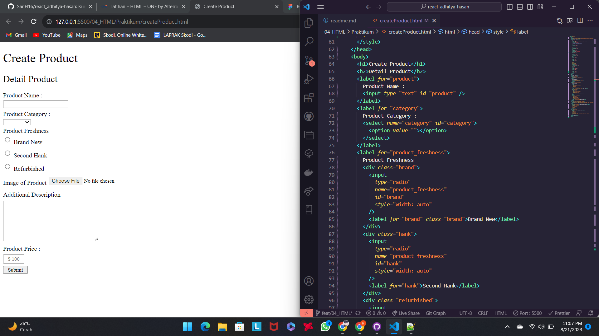
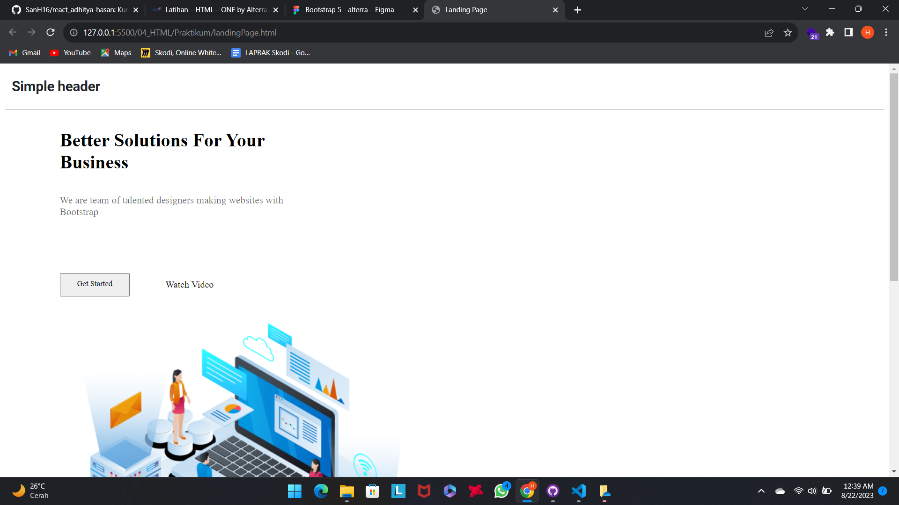
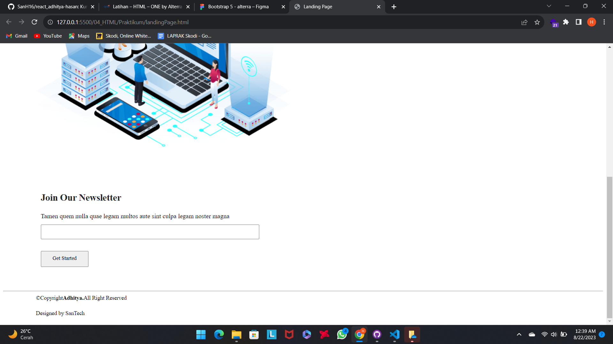
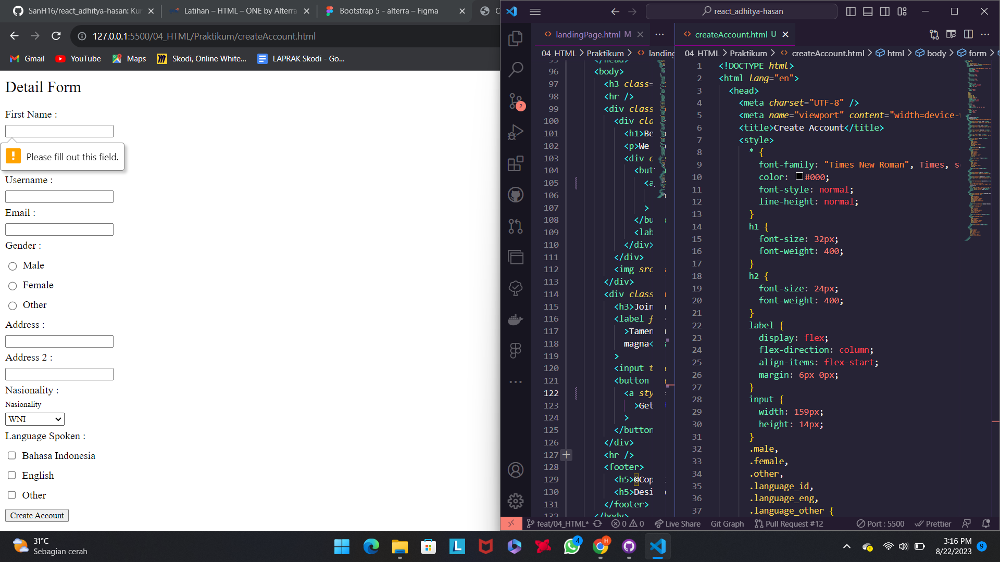
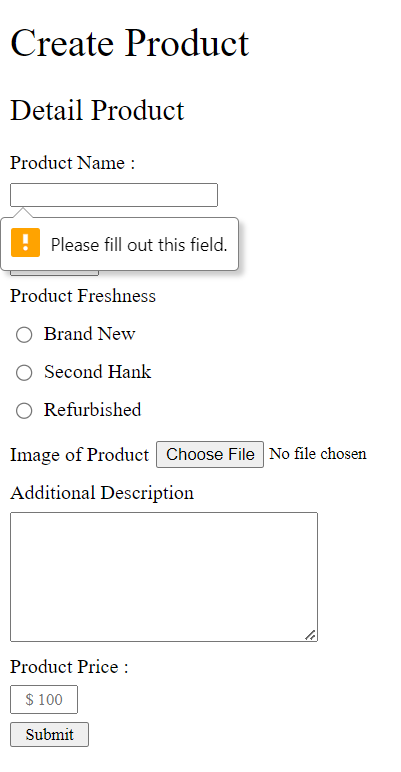
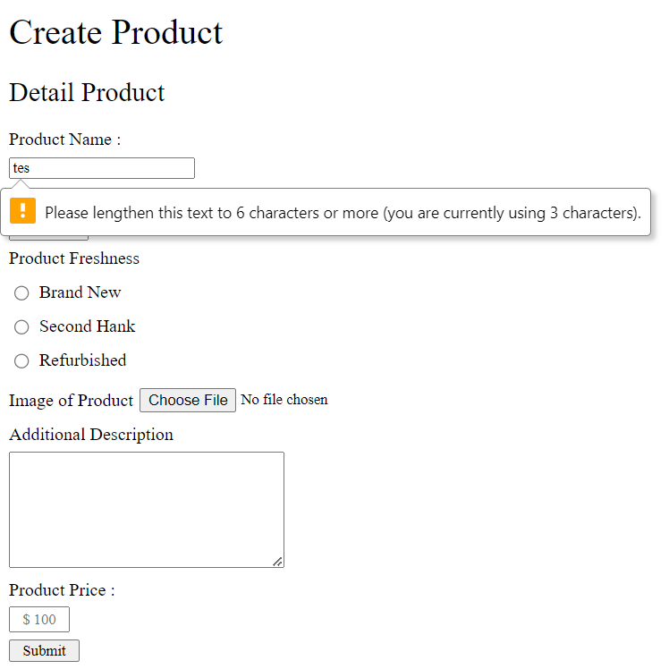
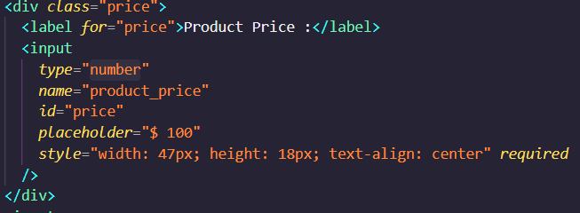
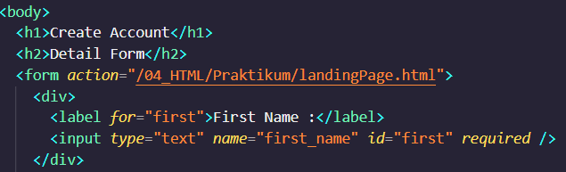
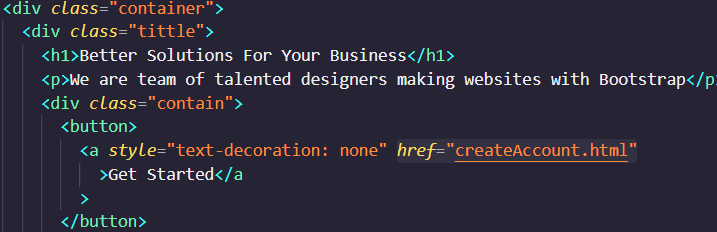

# Resume Materi KMReact - Hypertext Markup Language (HTML)

## 3 Poin penting

### - HTML

HTML merupakan singkatan dari (Hypertext Markup Language) sebuah standar teknologi yang digunakan oleh Web Developer untuk membuat dan menampilkan kode progam menjadi bentuk visual berupa halaman website yang dapat dibaca oleh manusia dan terstruktur mulai dari section header, main content, hingga footer.

### - Tag Dasar HTML

HTML merupakan fondasi atau kerangka dasar dalam pengembangan web. Elemen seperti html, head, dan body adalah bagian penting struktur HTML. Adapun element atau tag html yang sering digunakan untuk membuat text heading seperti h1 hingga h6, teks paragraf p, ul unordered list (list tidak berurut) dan ol ordered list (list berurutan) kemudian tag 'a' hyperlink sebagai penghubung baik halaman itu sendiri ataupun halaman lainnya.

### - HTML5

HTML5 adalah versi teknologi dengan berbagai fitur html terbaru yang telah dikembangkan untuk membangun website dengan Semantic Element agar dapat dibaca dengan mudah oleh SEO (Search Engine Optimization) seperti misal header, main, nav, footer, section, article dan sebagainya.

# Hasil Latihan HTML

## Create Product

    

## Landing Page

    

    

## Create Account

    

# Task

## Soal Prioritas 1 (Nilai 80)

Buatlah sebuah halaman Create Product dengan nama file createProduct.HTML

    <a href="createProduct.html">file createProduct.html</a>

Memiliki urutan dan nama form seperti di foto. atau bisa mengacu pada figma berikut. Link Figma

    

## Soal Prioritas 2 (Nilai 20)

Buatlah halaman landing Page dengan nama file landingPage.html dengan struktur seperti berikut. link figma

    

    

## Soal Eksplorasi (Nilai 20)

- Lakukan validasi “required” pada setiap form yang telah dibuat

    

- Terapkan standart validasi berikut
  form product Product Name mempunyai minimal 6 huruf dan maksimal 50 huruf
    

    Product Price harus berupa angka
    

- Sambungkan halaman landingPage.html dengan CreateAccount.html sehingga dapat berpindah halaman

    

    

