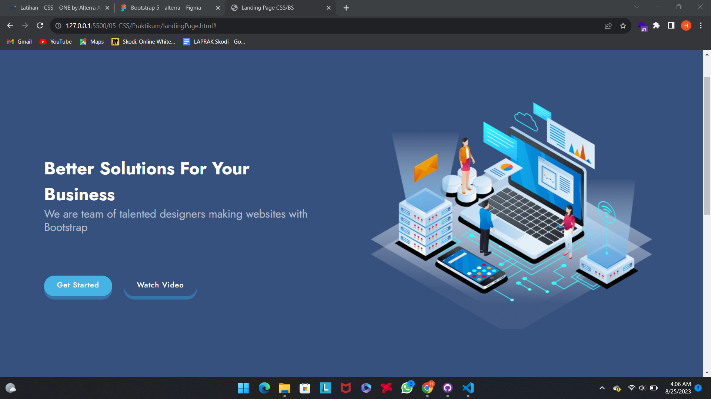
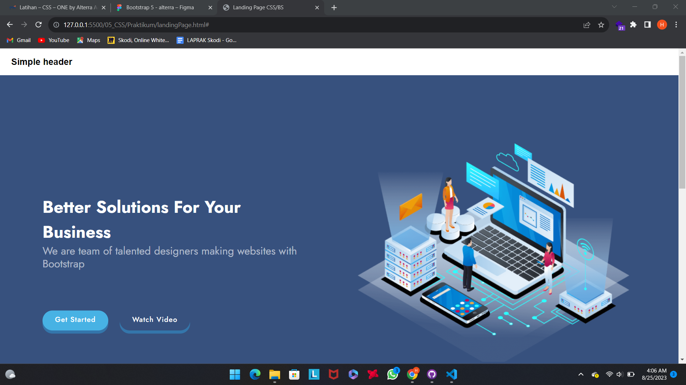
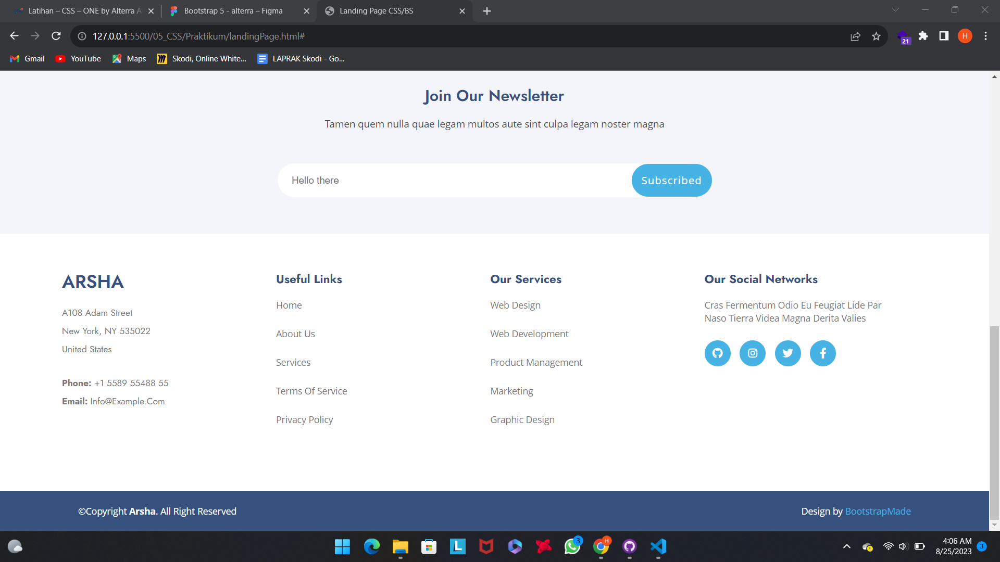
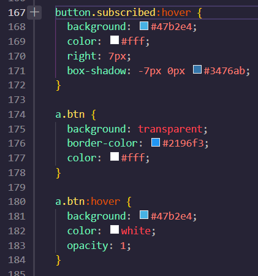
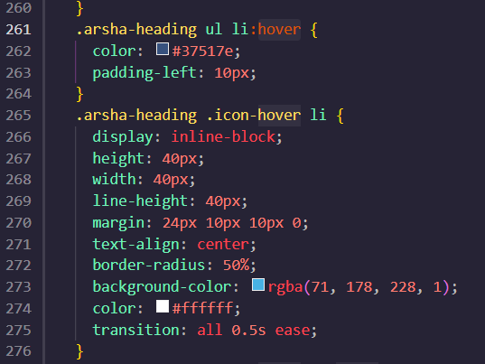
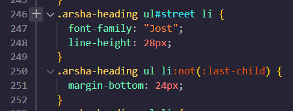
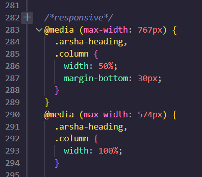
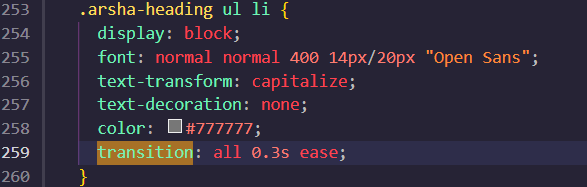
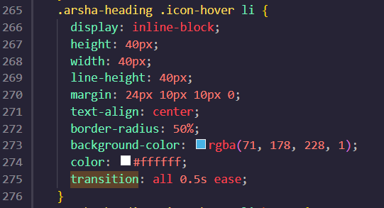

# Resume Materi KMReact - Cascading Style Sheets (CSS)

## 3 Poin penting

### - CSS

Cascading Style Sheets (CSS) merupakan teknologi yang berfungi untuk mengatur tampilan dari sebuah halaman website dengan mendekorasi kumpulan element HTML melalui dokumen terpisah. CSS memberikan fleksibilitas bagi pengembang web dalam mengatur layout, warna, font, dan berbagai elemen visual lainnya tanpa harus merubah langsung struktur konten HTML yang ada.

### - Selector, properties, value

Cara kerja CSS menggunakan Selector (Element HTML/Class/Id) sebagai target yang dipilih untuk diberikan styling. Kemudian di dalam selector terdapat kumpulan properti sebagai representasi bagaimana element tersebut akan ditampilkan, values merupakan nilai yang dimasukan kedalam properti.
h1 {
color: blue;
}

Dari code diatas, tag 'h1' sebagai Selector, 'color' menjadi properties sedangkan 'blue' direpresntasikan sebagai values.

### - Responsive

CSS media-query membuat tampilan Layout halaman website menjadi responsive untuk berbagai perangkat khusus. Dengan mengatur tata letak Element yang akan tampil berbeda terhadap ukuran layar tertentu.

# Hasil Latihan CSS

## Landing Page

    

    

    

# Task

## Soal Prioritas 1 (Nilai 80)

Dengan memanfaatkan css cobalah untuk membuat membuat halaman body dan footer di file landingPage.html menjadi seperti yang link figma.
Pada tugas ini header belum perlu dibuat, nantinya header dapat memanfaatkan boostrab

    

    

    

## Soal Prioritas 2 (Nilai 20)

Pada halaman LandingPage.html implementasikan efek hover pada form input atau element lain sesuai keinginan kalian.

    

 

    

 

Gunakan CSS pada external file dan implementasikan selection class CSS pada element HTML.
Terapkan CSS Specifity untuk selector element HTML dengan id, tag, class dll. seperti #header h1 > h1.

    

 

## Soal Eksplorasi (Nilai 20)

Buatlah halaman menjadi responsive untuk halaman LandingPage.html dengan media query pure CSS.

    

 

Terapkan efek transisi background, warna atau posisi di halaman LandingPage.html

    

 

    

 
