# Resume Materi KMReact - Bootstrap 5

## 3 Poin penting

### - Bootstrap

- Bootstrap adalah framwork CSS open source untuk membantu Frontend developer dalam membuat Website dengan template desain berbasiskan HTML dan CSS dengan berbagai komponen seperti button, form, navigation, font, grid dan sebagainya hanya dengan memanggil nama kelas dari dokumentasi Bootstrap. Selain itu, bootstrap memiliki ekstensi opsional JavaScript.

### - Responsive Design

- Dalam hal ini, bootstrap memberikan Layout responsive website hanya dengan menggunakan komponen class tertentu seperti nav, container, col, breakpoint dan grid system agar dapat responsive terhadap beberapa ukuran layar tertentu dari ponsel, tablet, hingga desktop.

### - Berbagai Komponen siap pakai

- Bootstrap membantu developer website dengan memberikan berbagai komponen yang siap pakai yang telah disusun dalam suatu class. Cara penggunaan nya cukup mudah seperti misal class="container mx-auto col-12". Adapun istilah Sicing and Spacing yang sering digunakan :
  mx-0 : margin kanan kiri
  px-0 : padding kanan kiri
  col-lg-12 : kolom dengan ukuran layar Larger sebanyak 12 kolom
  fs : font size (ukuran font)
  fw : font weight (tinggi font)
  h-0 / w-0 : lebar dan panjang dan masih banyak lagi.

# Hasil Latihan Bootstrap

## e Startup Welcome Page

    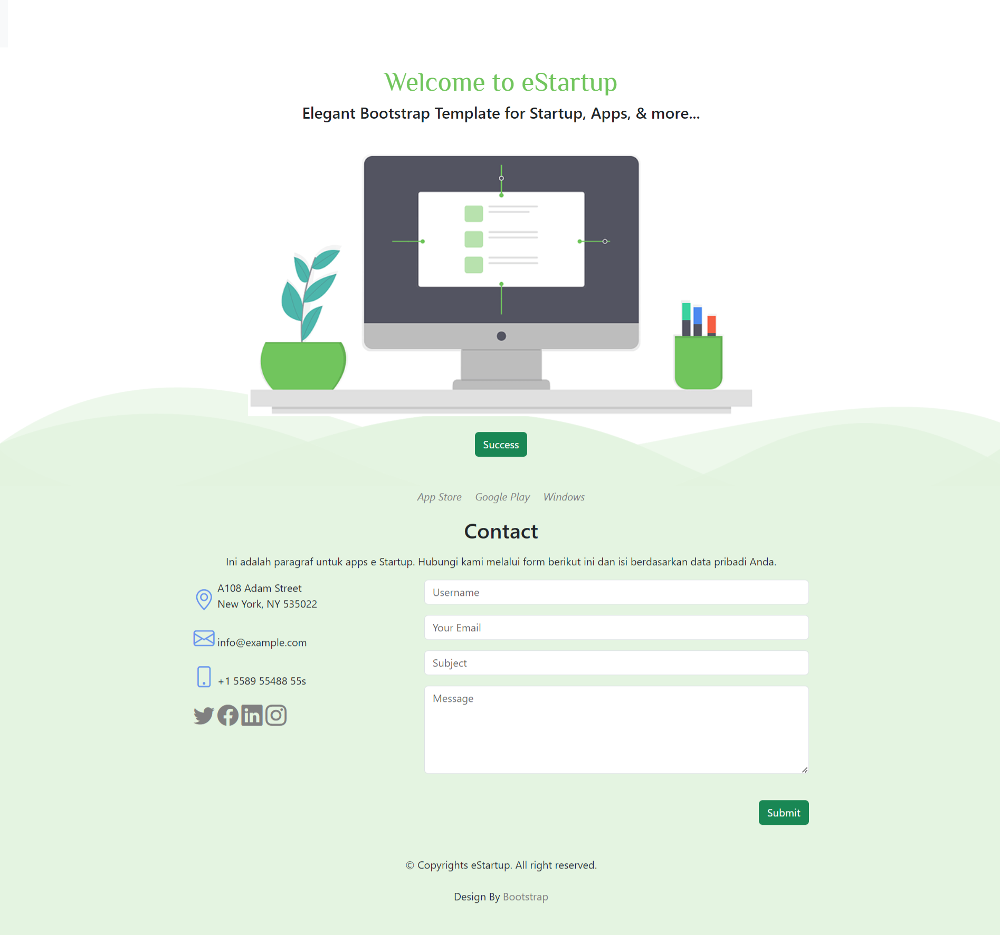

# Hasil Praktikum Bootstrap

### Landing Page

    

### Create Product

    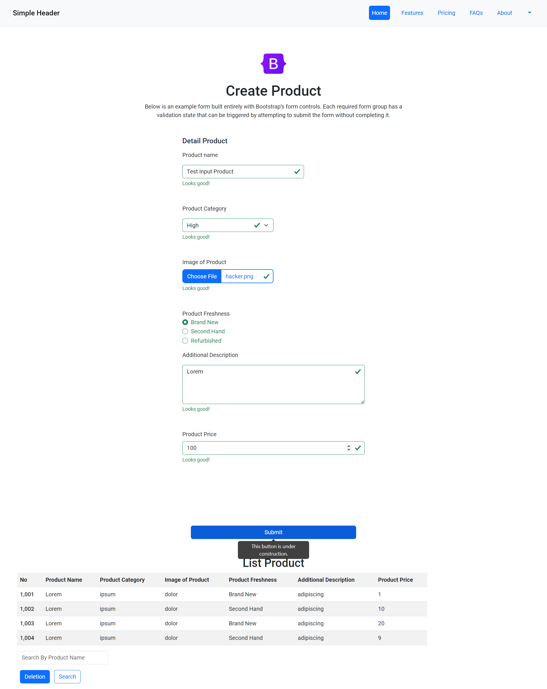

# Task

## Soal Prioritas 1 (Nilai 80)

- Gunakan komponent bootstrap seperti navbar untuk membuat navigation di LandingPage.html

    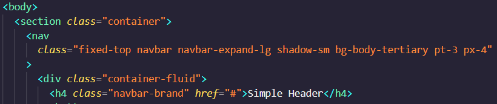

- Gunakan komponent bootstrap seperti button dan form di halaman CreateProduct.html

    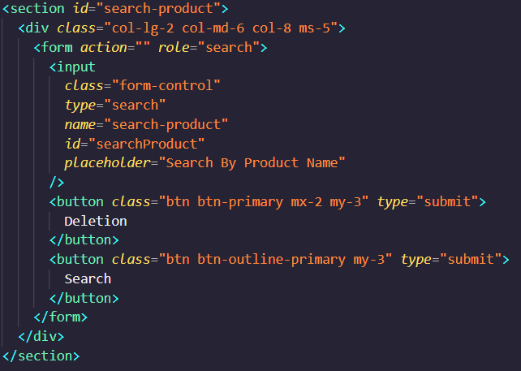

    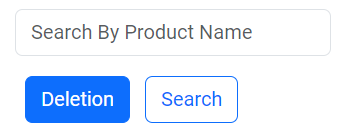

- Buatlah halaman CreateProduct.html seperti gambar dibawah. link figma

    

    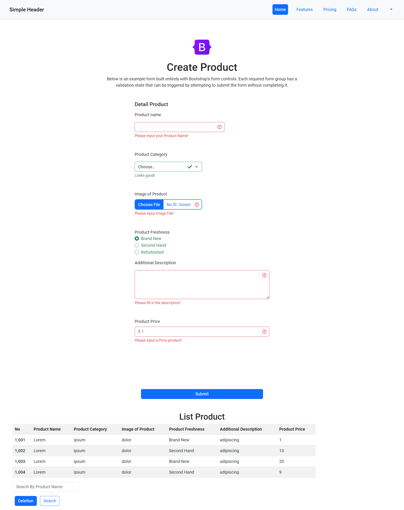

## Soal Prioritas 2 (Nilai 20)

- Gunakan grid system dari BS ketika membuat CreateProduct.html.

    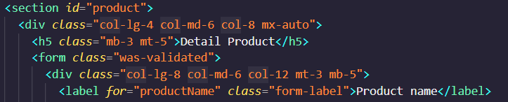

    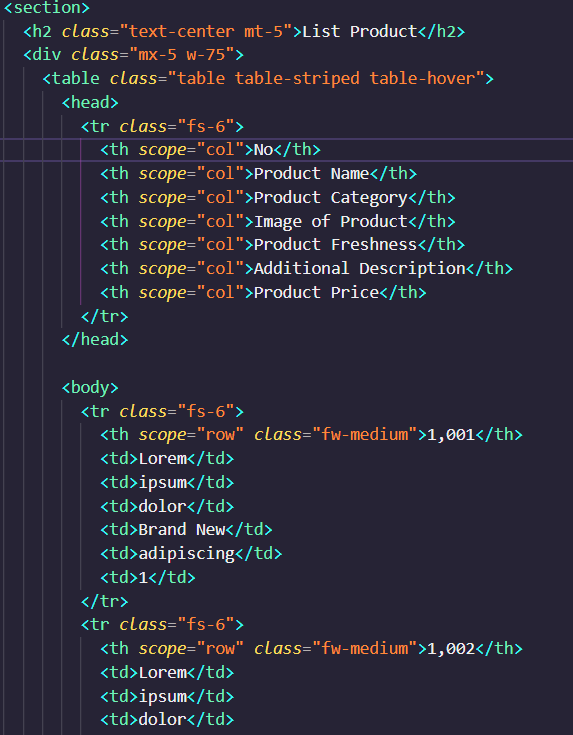

    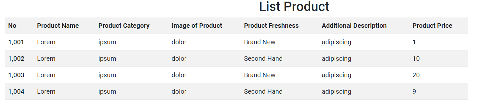

- Buatlah halaman memiliki validasi memanfaatkan BS

    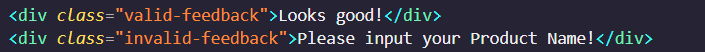

    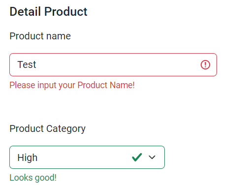

    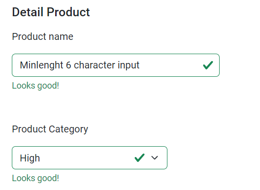

## Soal Eksplorasi (Nilai 20)

- Terapkan JavaScript plugin di bootstrap seperti Modal, Carousel, atau Tooltip di halaman CreateProduct.html/LandingPage.html . desain tidak ditentukan, kalian bebas menambahkan sesuai keinginan kalian.

    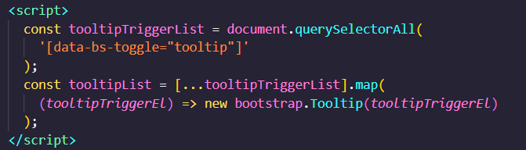

    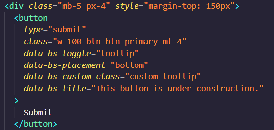

    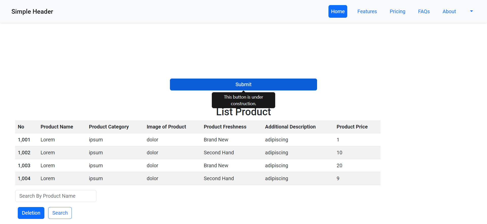

- Buat alert dengan bootstrap ketika validasi input form di CreateAccount.html salah

    

    

