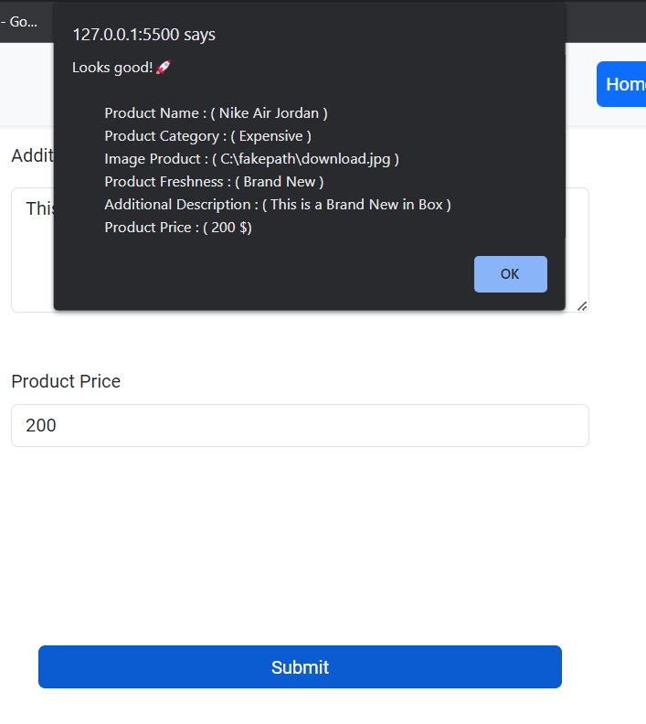
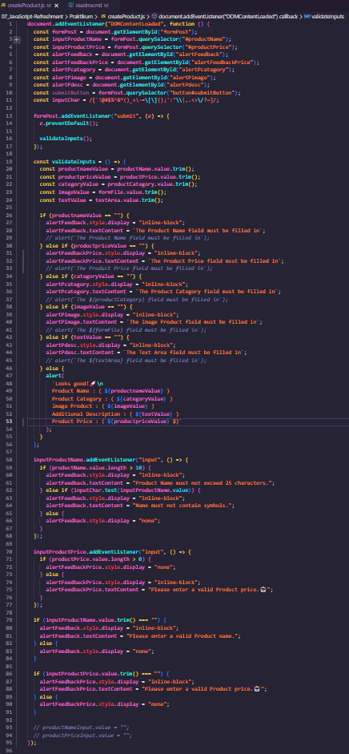
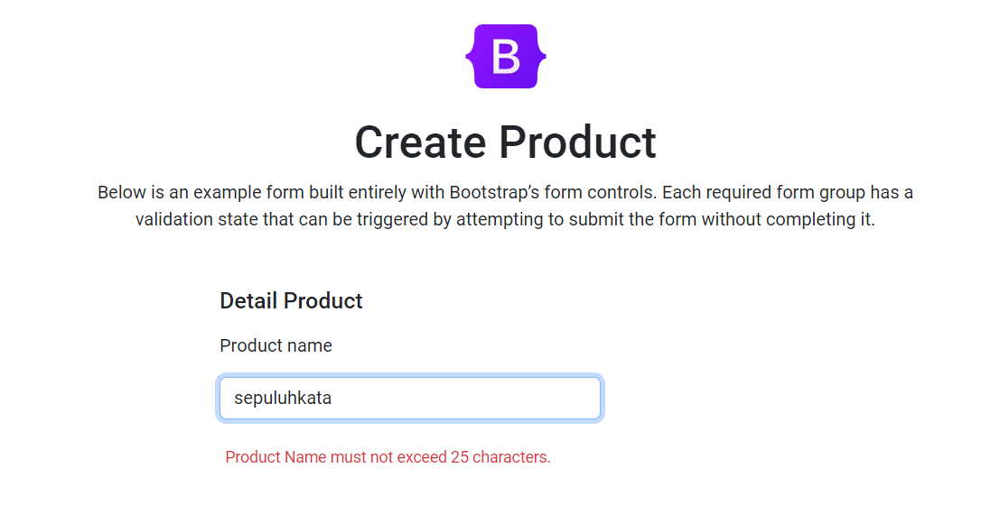
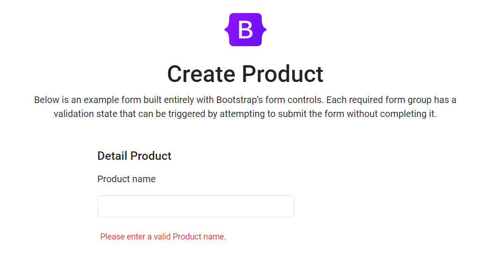
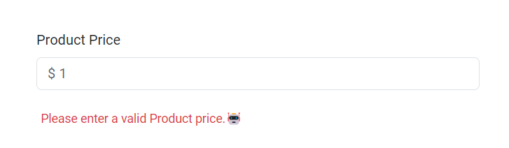
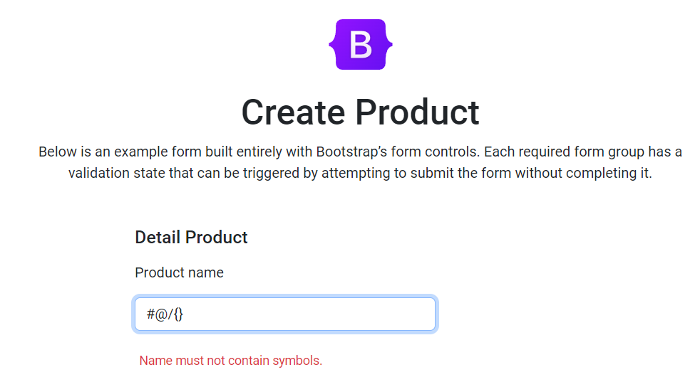
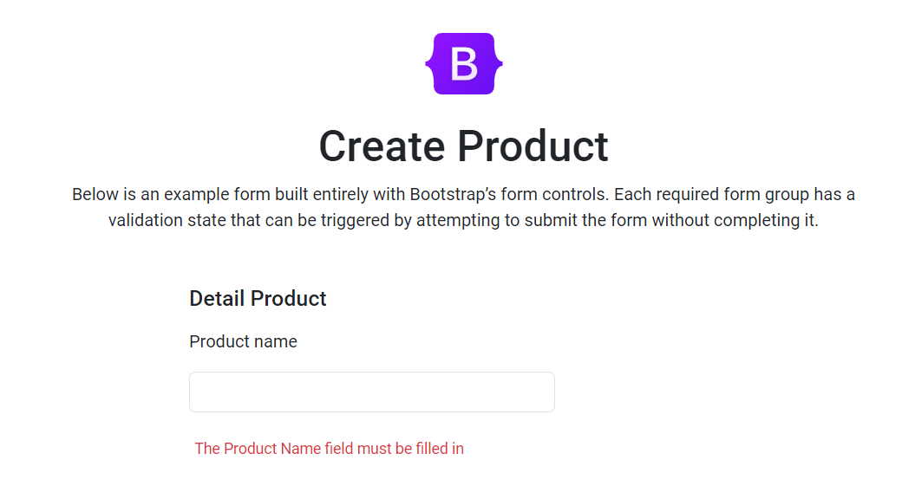
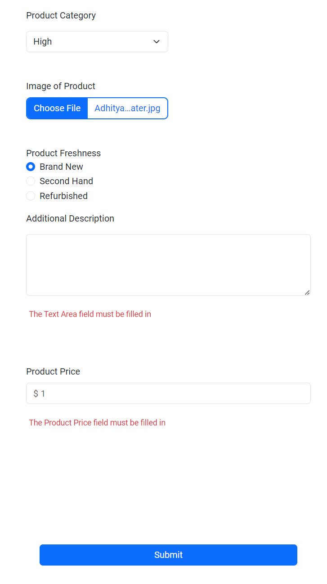
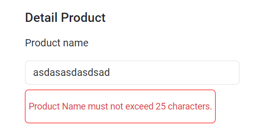
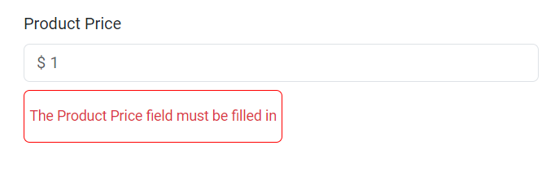

# # Resume Materi KMReact - JavaScript Refreshment

## 3 Poin penting

### - JavaScript

Javascript merupakan bahasa pemrograman yang biasanya digunakan untuk mengembangkan aplikasi web interaktif. Dalam JavaScript dapat menambahkan kumpulan function, validasi, array, object, method, DOM / Manipulasi DOM dan berbagai Interaktivitas ke dalam halaman suatu website.

Banyak sekali komponen di dalam Javascript antara lain :

- Tipe data, merupakan tipe dari suatu value didalam variable (cth: string, number, symbol ...).
- Operator, biasanya digunakan jika ingin menjumlah, membandingkan satu operand dengan operand lainnya (cth: ++, -, ==, \*\*, //).
- Conditional, menentukan statement kemudian dijalankan dalam suatu block (cth: if, else if, else, switch, ternary).
- Array method , kumpulan method untuk memodifikasi key & values dari sekumpulan array, array dibungkus dengan [].
- Object, kumpulan array yang dibungkus dalam suatu block {} yang biasa disebut dengan Object.
- Looping, sebuah perulangan yang berjalan sesuai dengan kondisi didalam statement.
- Function, kumpulan prosedur yang dapat dipanggil dan biasanya mengembalikan nilai sesuai operasi dalam parameternya.
- DOM, Document Object Model biasanya digunakan untuk memanipulasi element HTML menjadi lebih interaktif.

JavaScript, bahasa pemrograman yang dijalankan oleh mesin JavaScript yang ada dalam browser atau server. Hal ini membuat kode JavaScript tidak perlu dikompilasi sebelum dijalankan atau JavaScript merupakan intrepeter language. Javascript saat ini masih populer dan memiliki komunitas yang luas.

## Output yang dihasilkan

    

    

# Task

## Soal Prioritas 1 (Nilai 80)

Pada halaman CreateProduct.html tangkap data pada form input Product Name tambahkan dengan JS DOM dan lakukan validasi seperti berikut :

- Product Name tidak boleh melebihi 25 karakter
- Jika Product Name melebihi 10 karakter tambilkan pesan error atau peringatan/alert seperi "Last Name must not exceed 25 characters."

    

- Product Name dan Product Price tidak boleh kosong. Jika field tersebut kosong saat tombol Submit/Create Product di tekan maka tampilkan alert atau error bahwa field tersebut tidak boleh kosong. Misal "Please enter a valid Product name.".

    

    

## Soal Prioritas 2 (Nilai 20)

Pada halaman CreateProduct.html tangkap data pada form input tambahkan dengan JS DOM dan lakukan validasi seperti berikut :

- Procut Name tidak boleh mengandung karakter seperti @/#{}
- Jika Procut Name mengandung symbol @/#{} tampilkan pesan error atau peringatan misal "Name must not contain symbols."

    

- Validasi input setiap form bahwa field tidak boleh kosong. Jika field kosong saat form dikirim maka tampilkan pesan error “The xxx field must be filled in”

    

    

## Soal Eksplorasi (Nilai 20)

Pada halaman CreateProduct.html tangkap data pada form yang telah dibuat kemudian tambahkan dengan JS DOM dan lakukan validasi seperti berikut :

- Buatlah script DOM JavaScript untuk menonaktifkan tombol Submit/Create Accountjika salah satu input tidak valid/salah/belum di isi.

- Jika salah satu field tidak valid/salah berikan border merah atau tampilkan icon error pada field tersebut dengan JS DOM.

    

    

- jika semua form telah diisi sesuai dengan falidasi dan user melakukan klik pada button Submit maka akan terdapat alert yang mengeluarkan setiap data.

    

