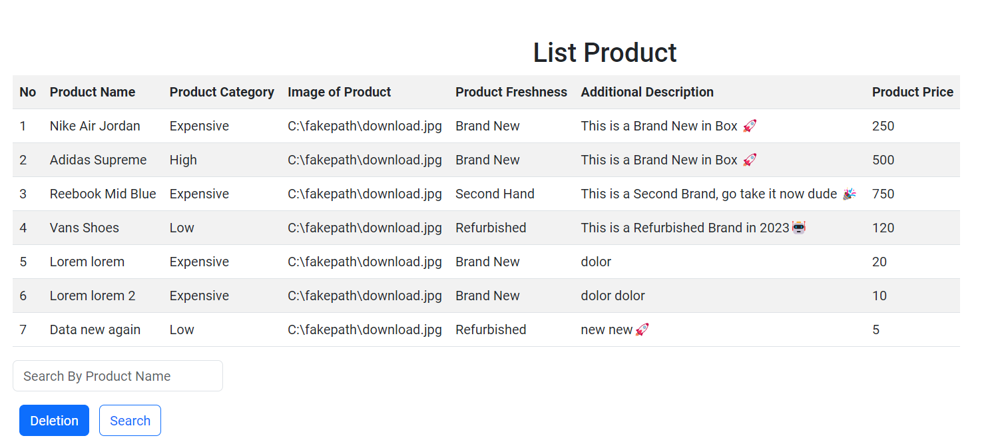
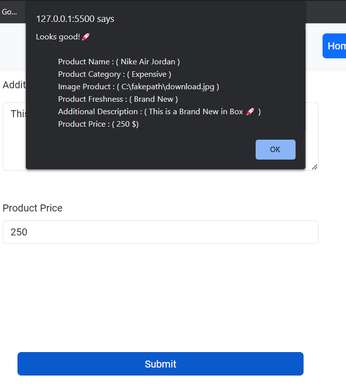
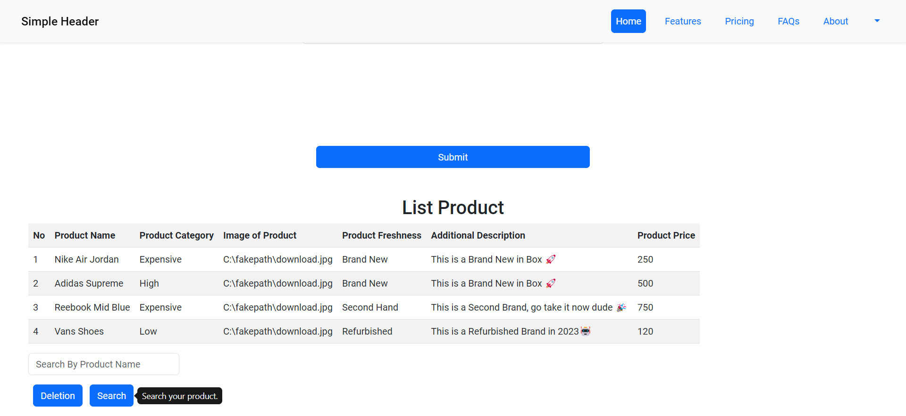
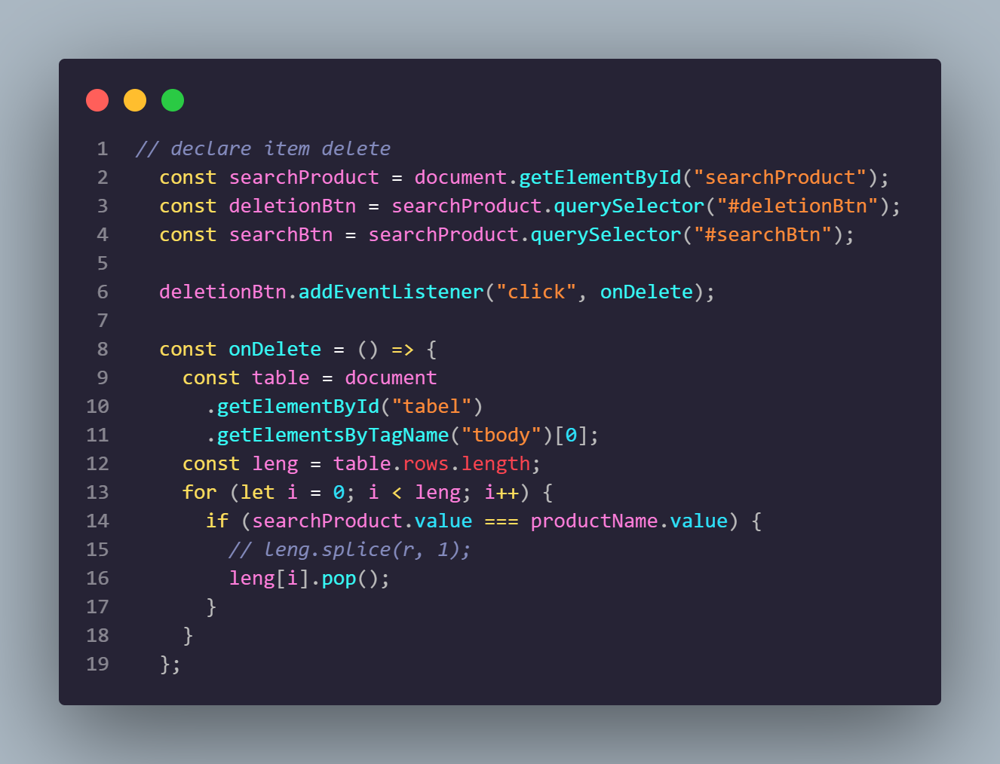
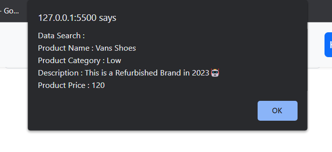

# Resume Materi KMReact - Introduction Data Structures

## 3 Poin penting

### - Array

## Hasil

    

# Task

## Soal Prioritas 1 (Nilai 80)

- Masukkan setiap data yang telah berhasil di validasi ke dalam tabel seperti gambar dibawah. (Read)
  Jika kalian berhasil memasukkan data pertama maka kalian akan di anggap berhasil mengerjakan soal berikut. image belum harus berfungsi. boleh kosongkan atau tulis default name.

    

    

## Soal Prioritas 2 (Nilai 20)

- Jumlah dari data akan selalu bertambah jika user terus mengisi form yang telah kalian buat. (Insert)
  jika data kedua dan seterusnya berhasil masuk ke dalam tabel maka kalian di anggap berhasil mengerjakan soal berikut

    

    

## Soal Eksplorasi (Nilai 20)

- Buatlah tombol deletion(Delete) berfungsi. tombol deletion akan selalu menghapus nilai terakhir yang di masukkan oleh user. (Delete)

    

Buatlah tombol search berfungsi. tombol search akan mencari data dan menampilkan datanya pada alert berdasarkan username. (Search)

    

