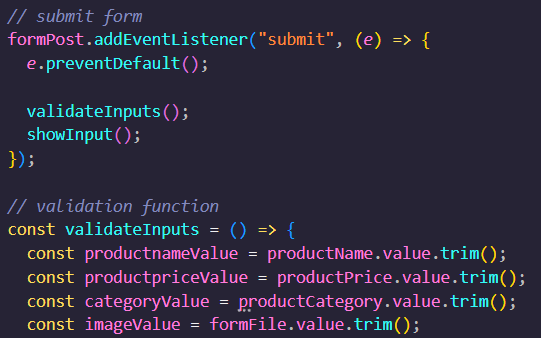
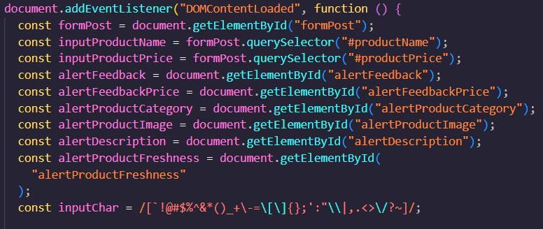
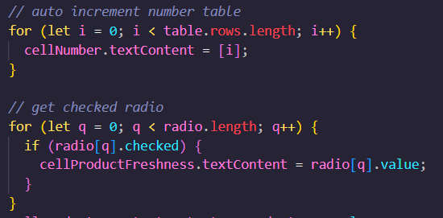
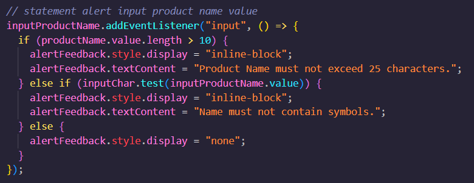

# Resume Materi KMReact - Clean Code

## 3 Poin penting

## Clean Code

Clean code adalah istilah menulis setiap baris kode yang mudah dibaca, diubah dan dipahami oleh manusia. Dengan menerapkan clean code dapat memudahkan dalam hal berkolaborasi, pengembangan fitur selanjutnya, dan mempercepat development itu sendiri karena kode yang ditulis sederhana dan efisien.

## Karakteristik Clean Code

- Mudah dipahami : baris kode yang ditulis mudah dihapami apabila penamaan variabel tersebut jelas dan memiliki makna yang relevan.
- Mudah dieja dan dicari
- Singkat namun mendiskripsikan konteks
- Konsisten dalam menulis kode, misal deklarasi, fungsi, dan output ditulis secara dengan gaya penulisan yang sama
- Memberikan komentar hanya jika diperlukan

## KISS DRY and Refactoring

- KISS (Keep it so simple ) : membuat baris kode yang sederhana dan membuat fungsi hanya untuk menjalankan satu konteks saja, tidak memiliki argumen yang terlalu banyak.
- DRY (Don't Repeat Yourself) : menghindari duplikasi fungsi yang berulang.
- Refactoring : mengubah kode struktu kode internal yang rumit menjadi lebih sederhana tanpa mengubah perilaku eksternal. Refactoring bertujuan untuk mengurangi steps/perulangan dan meningkatkan performa dari fungsi/kode tersebut.

# 📝 Task

## Soal Prioritas 1 (Nilai 80)

Terapkan clean code terkait hal berikut

- Kemudahan baca: Kode harus mudah dibaca, dipahami, dan dipelihara, dengan menggunakan nama variabel yang bermakna dan komentar di tempat yang diperlukan.
- Konsistensi: Kode harus mengikuti konvensi nama yang konsisten dan gaya pengkodean sepanjang proyek.

    

    

## Soal Prioritas 2 (Nilai 20)

Terapkan clean code terkait hal berikut

- Simpel: Kode harus sesederhana mungkin, menghindari logika kompleks dan kode yang tidak perlu.
- Efisiensi: Kode harus dioptimalkan untuk performa dan menghindari perhitungan atau operasi yang tidak perlu.

    

## Soal Eksplorasi (Nilai 20)

Terapkan clean code 100% pada setiap aspek dan menerapkan hal berikut

- Kemudahan uji: Kode harus mudah diuji dan harus meliputi tes otomatis untuk memvalidasi fungsinya.
- Penanganan error: Kode harus memiliki mekanisme penanganan error yang tepat untuk menangani pengecualian dan masukan yang tidak terduga.
- Dokumentasi: Kode harus mencakup dokumentasi dan komentar yang relevan untuk membantu memahami tujuan dan fungsionalitas kode.

    

