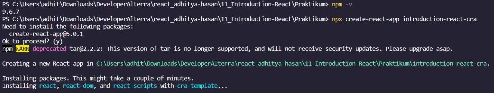
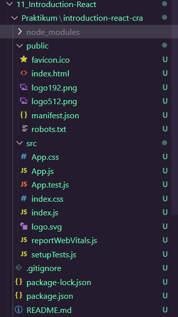
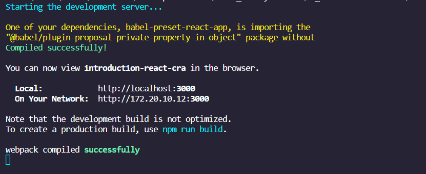
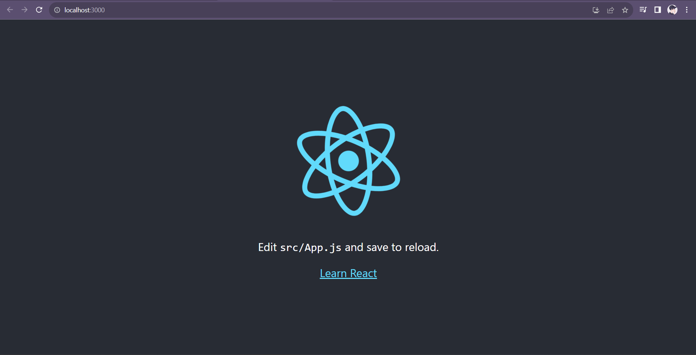
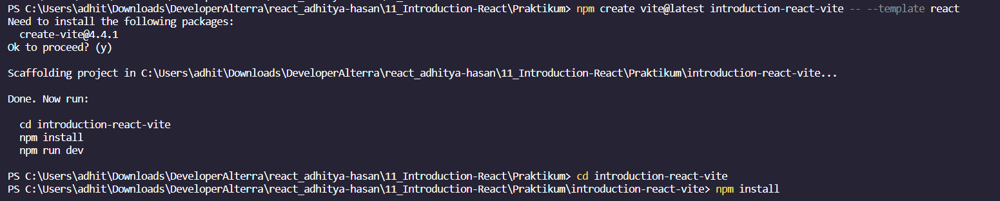
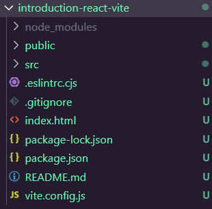
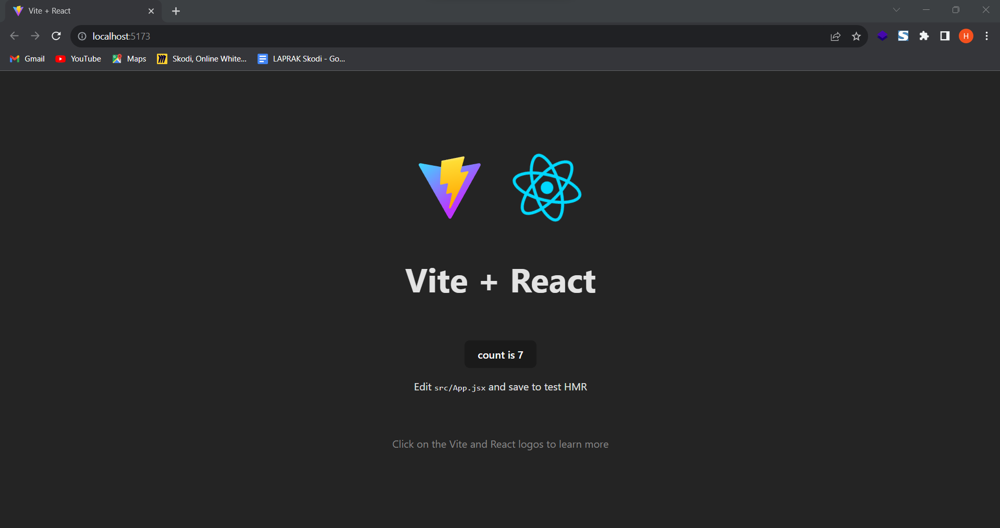
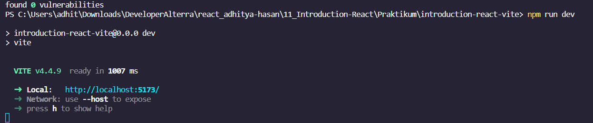

# Resume Materi KMReact - Introduction React

## 3 Poin penting

## React

# 📝 Task

## Soal Prioritas 1 (Nilai 80)

- Lakukan Installation react menggunakan CRA (Create React App)

    

    

## Soal Prioritas 2 (Nilai 20)

- Jalankan react pada local dan pastikan tampilan seperti gambar di bawah

    

    

## Soal Eksplorasi (Nilai 20)

Buatlah project react menggunakan vite.
Jalankan pada local
How To Set Up a React Project with Vite | DigitalOcean

    

    

    

    

