# Resume Materi KMReact - Event Handling

## 3 Poin penting

### - Event Handling

# Task

### Soal Prioritas 1 (Nilai 80)

- Buatlah sebuah button dan terapkan event handling onClick pada salah satu tombol dihalaman CreateProduct.jsx. Jika tombol tersebut di-klik nantinya akan menampilkan random number di console.

    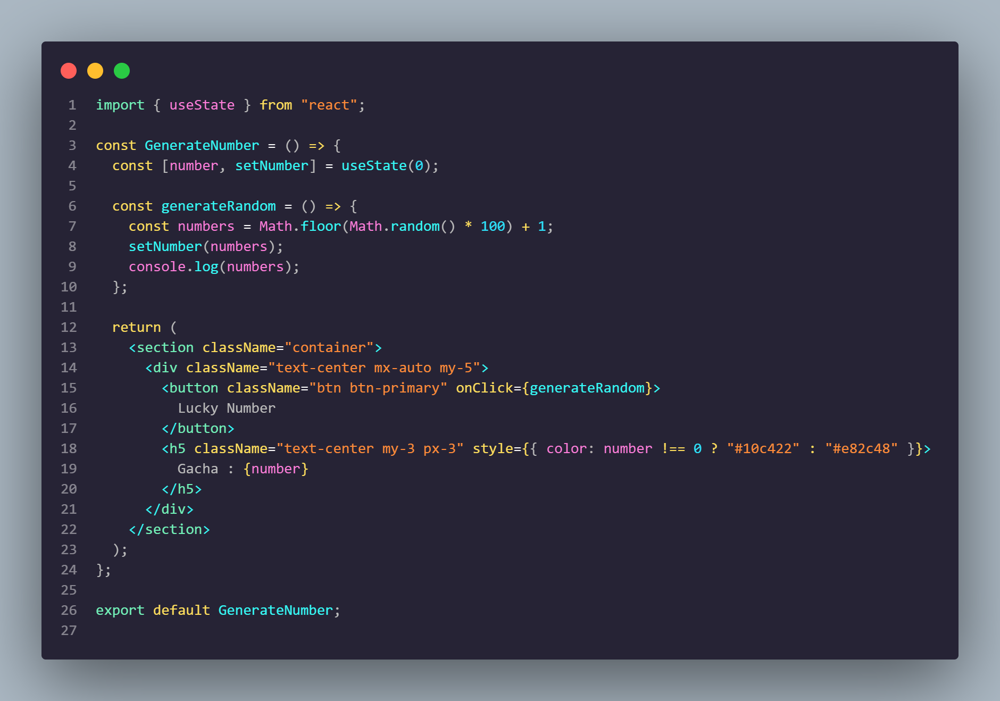

    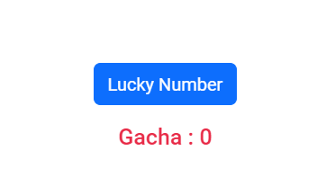

    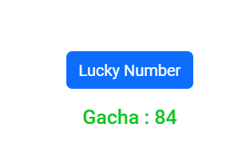

    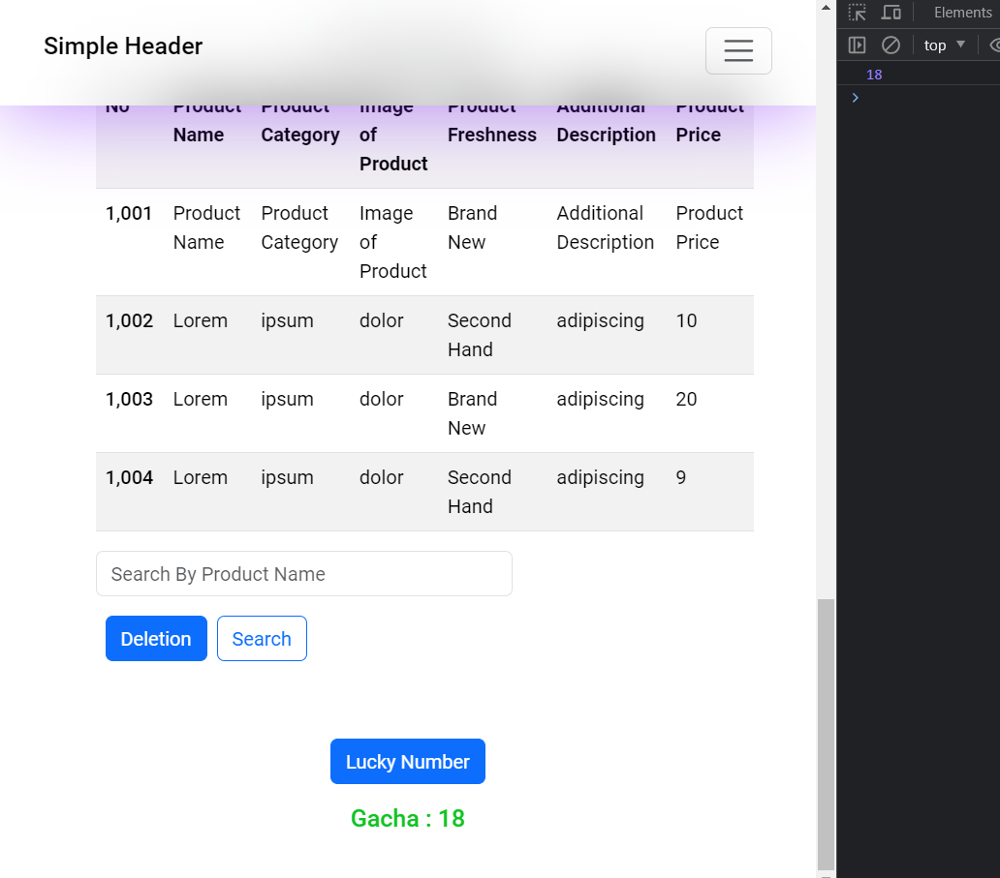

- Buatlah sebuah file yang berisikan object berikut

    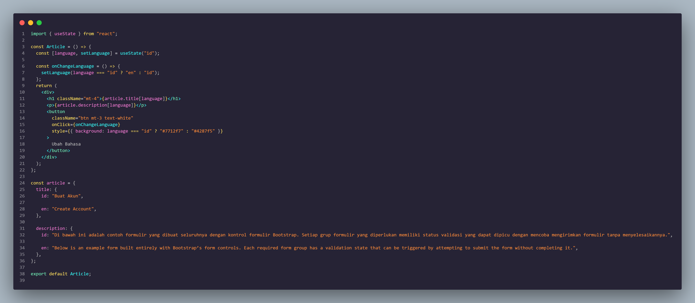

### Soal Prioritas 2 (Nilai 20)

Gunakan event handling onChange untuk validasi value secara realtime yang dimasukan kedalam form input. Validasi ini meliputi :

- Product Name tidak boleh melebihi 10 karakter

    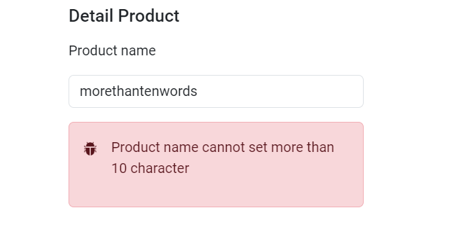

- Jika Product Name melebihi 25 karakter tambilkan pesan error atau peringatan/alert seperi "Last Name must not exceed 25 characters."

    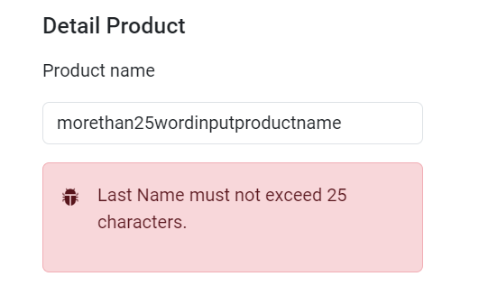

- Product Name tidak boleh kosong. Jika field tersebut kosong saat tombol Submit/Create Product di tekan maka tampilkan alert atau error bahwa field tersebut tidak boleh kosong. Misal "Please enter a valid product name."

    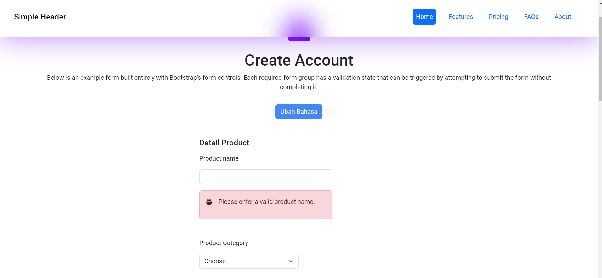

### Soal Eksplorasi (Nilai 20)

Pada halaman CreateProduct.jsx lakukan validasi seperti berikut

- Jika salah satu field tidak valid/salah berikan border merah atau tampilkan icon error pada field tersebut dengan React Event Handling. (product freshness tidak harus memiliki validasi)

    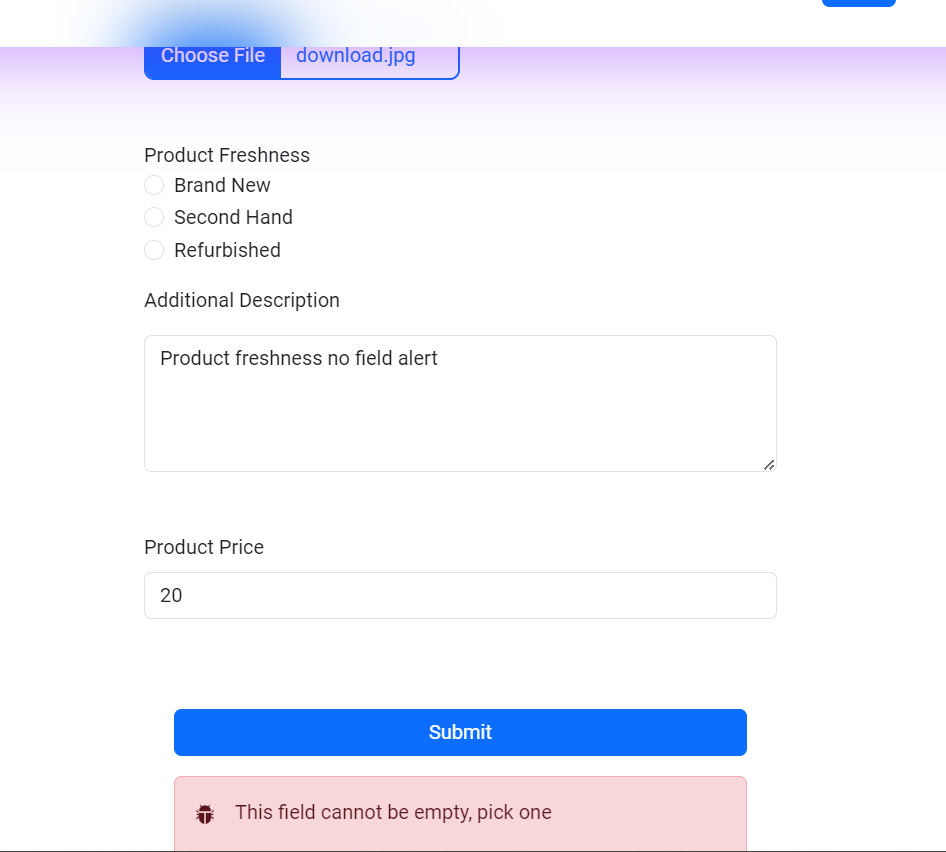

Buatlah button untuk mengganti text pada halaman.

- Buatlah sebuah button yang berfungsi mengganti bahasa yang digunakan pada halaman CreateProduct.jsx . Jika tombol itu di klik maka title dan deskripsi text pada halaman CreateProduct.jsx akan berubah menjadi text indonesia.

    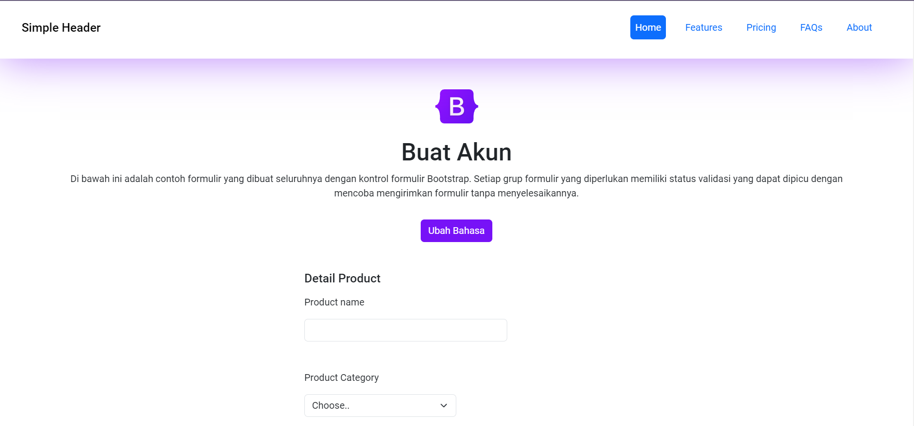

- Ketika kita menggunakan text indonesia dan melakukan klik pada button tersebut akan berganti menjadi text inggris.

    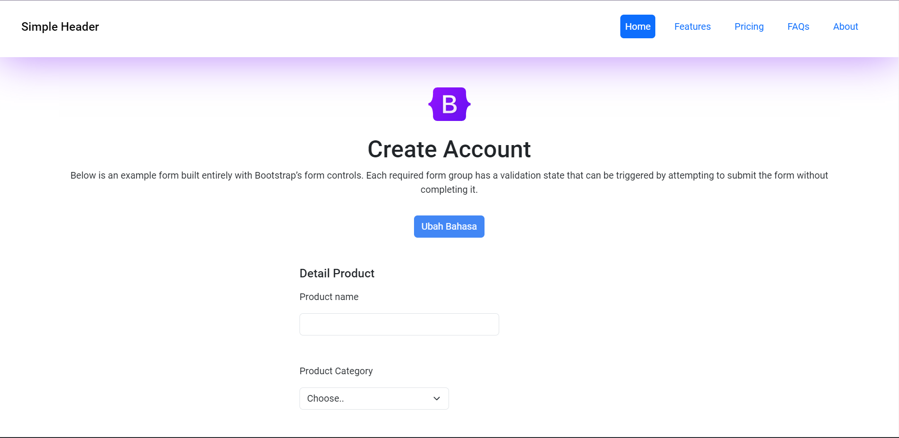

