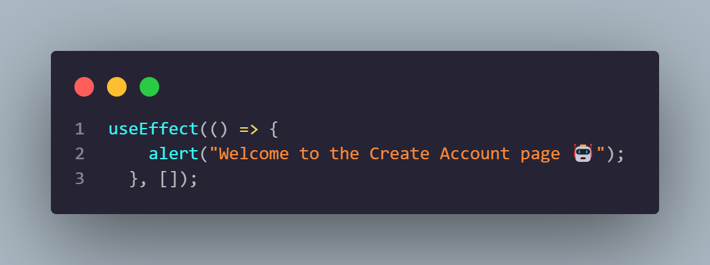
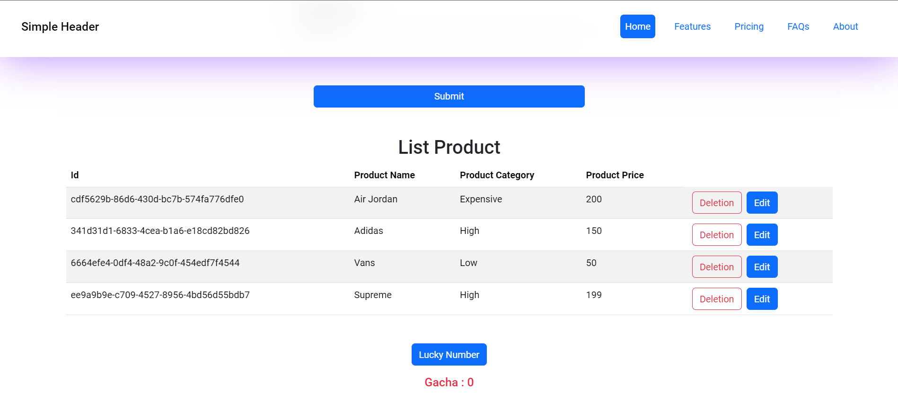
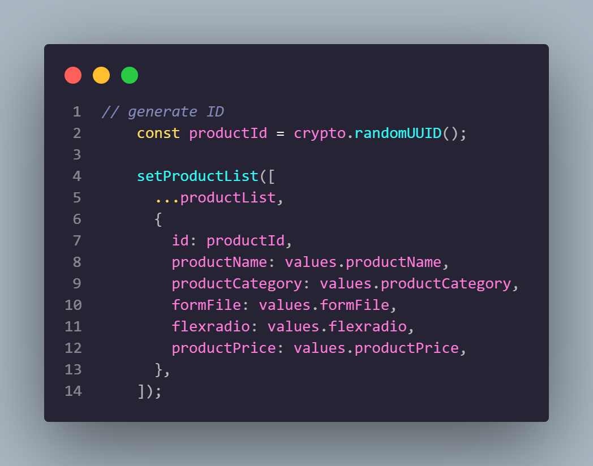
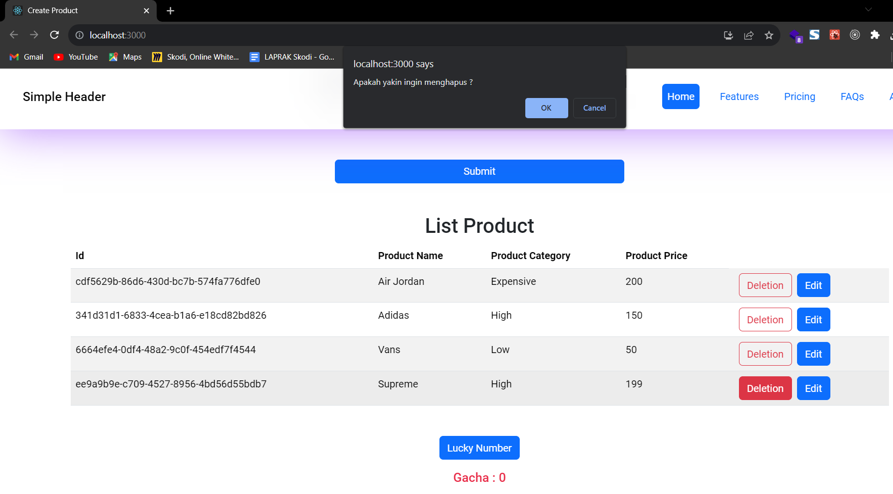
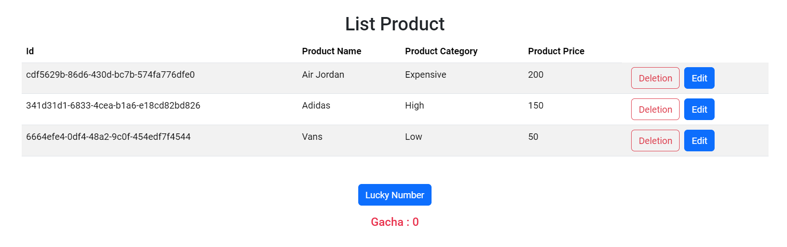

# Resume Materi KMReact - React Hooks

## 3 Poin penting

### - React Hooks

React Hooks adalah fitur baru di React yang memungkinkan menggunakan state dan fitur React lainnya tanpa membuat kelas komponen. Dengan Hooks, komponen react dapat dibuat dengan lebih efisien dan ringkas tanpa menggunakan class component seperti this, constructor, super dan lain-lain.

### - Hooks yang sering digunakan

Ada beberapa hook yang sering digunakan, yaitu:

- useState: digunakan untuk mengelola state di dalam komponen
- useEffect: digunakan untuk melakukan efek samping di dalam komponen
- useRef: digunakan untuk mengakses DOM node di dalam komponen

### - Kelebihan React Hooks

Berikut adalah beberapa keunggulan jika menggunakan React Hooks:

Kode lebih ringkas dan mudah dibaca
Fleksibilitas lebih tinggi
Performa lebih baik

# Task

## Soal Prioritas 1 (Nilai 80)

- Dengan menggunakan useEffect buatlah sebuah alert yang bertulisan “Welcome” ketika mereka membuka halaman CreateAccount.

    

- Dengan menggunakan UseState masukkan setiap data yang kalian isi pada halaman CreateProduct ke dalam tabel. data yang akan tampil hanya no,Product Name, Product Category, Product Feshness dan Product Price. data yang lain tidak di tampilkan pada user interface. ilustrasi tabel dapat dilihat pada gambar di bawah

    

- Nomor dibuat random menggunakan UUID atau sejenisnya. pastikan tidak ada duplikasi nomor.

    

## Soal Prioritas 2 (Nilai 20)

- Buatlah tombol delete berfungsi, pastikan ketika ingin melakukan delete terdapat alert/modal/notifikasi yang bertuliskan apakah kalian ingin menghapus.
Jika pilih hapus maka data baru akan terhapus.
  

    

Jika pilih tidak maka alert/modal/notifikasi akan hilang.

    

