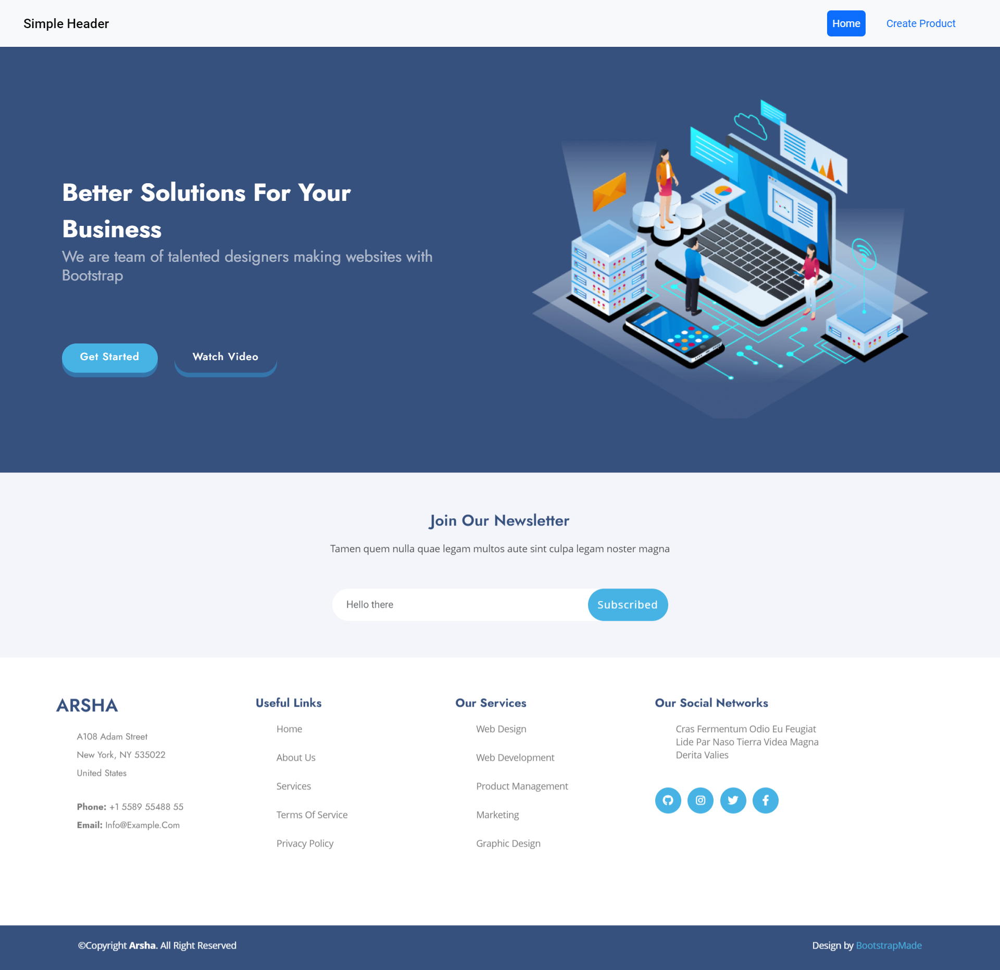
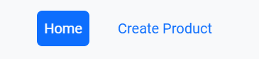
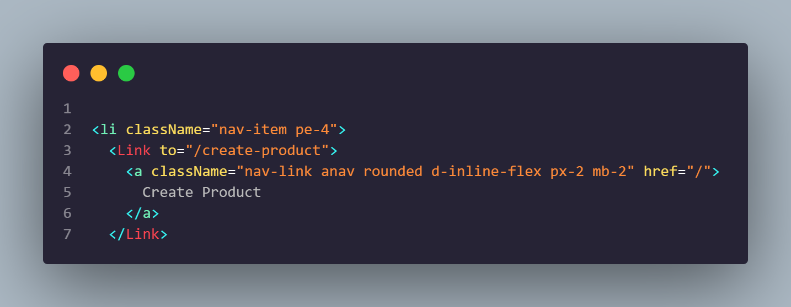
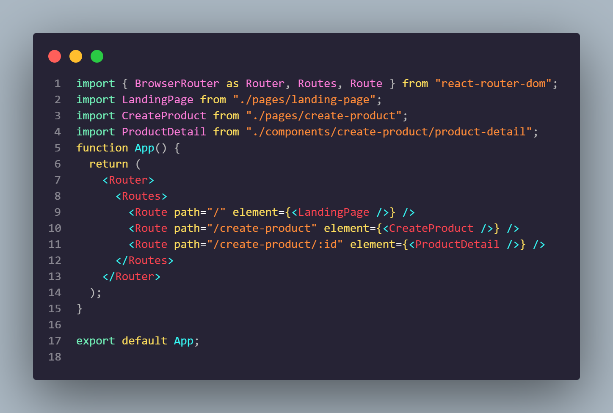
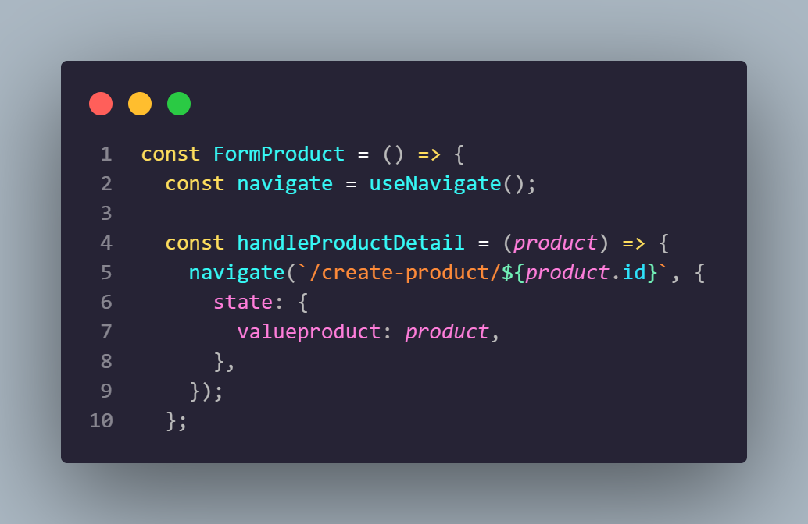
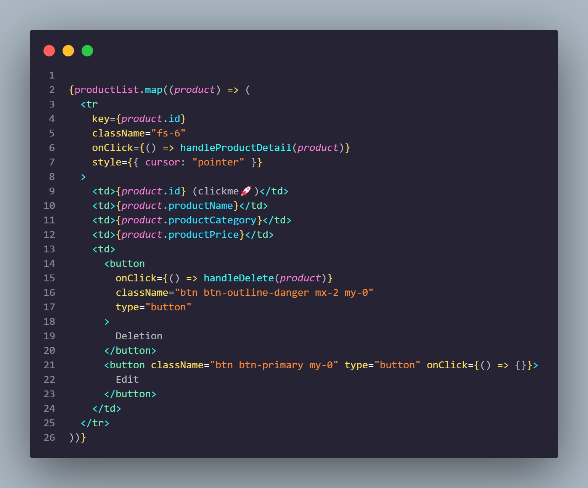
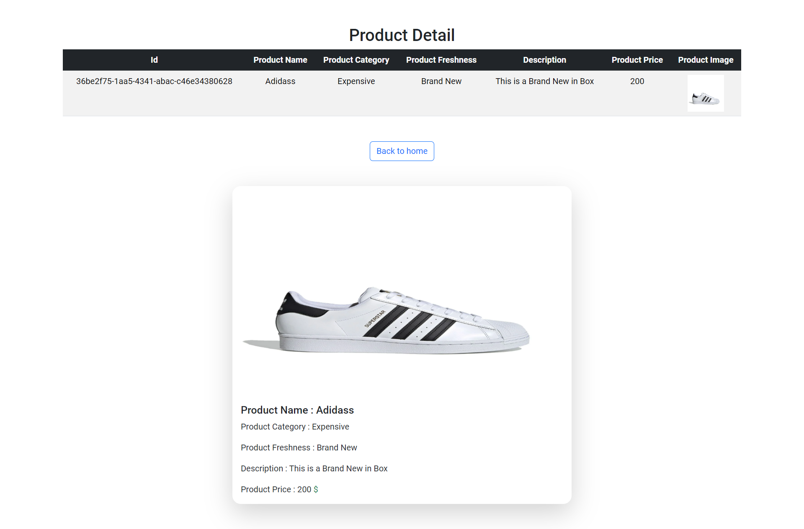
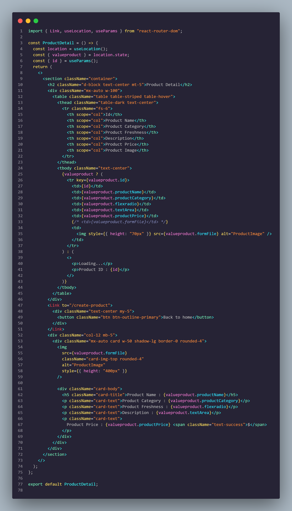

# Resume Materi KMReact - React Router

## 3 Poin penting

### - React Routing

React routing adalah sebuah library yang digunakan dalam aplikasi React untuk membuat routing dan navigasi antar halaman. Dengan React Router dapat digunakan untuk membuat sebuah aplikasi web yang memiliki banyak halaman dengan URL yang berbeda-beda.

### - SPA vs MPA

SPA merupakan singkatan dari Single Page Application, sedangkan MPA adalah Multi Page Application dimana MPA ini sering digunakan untuk membuat traditional web apps. SPA memiliki keunggulan dalam melakukan routing karena semua component dapat dialokasikan dan dirender hanya pada saat diperlukan dengan bantuan Routing dari React Router.

### Use URL Paramsa

Parameter URL adalah suatu parameter yang nilainya ditetapkan secara dinamis dalam path URL, misal params dinamis yang sering digunakan untuk routing page antara lain : id, name, number . Contoh path="/create-product/:id"

# Task

## Soal Prioritas 1 (Nilai 80)

- Buatlah halaman LandingPage berdasarkan LandingPage.html yang telah kalian buat pada tugas sebelumnya

    

- Tambahkan tombol pada komponen LandingPage.jsx untuk menavigasi ke komponen CreateProduct.jsx dan Gunakan React Routing untuk navigasi antara component LandingPage.jsx dan CreateProduct.jsx

    

    

    

## Soal Prioritas 2 (Nilai 20)

- Dengan memanfaatkan react routing buatlah fitur ketika user melakukan klik salah satu data pada tabel maka akan masuk ke halaman lain dan memunculkan data tersebut secara lengkap.

    

    

- Contoh : ketika user melakukan klik pada nomor “1,001” maka halaman akan berganti ke routing baru “localhost/account/1,001”. pada halaman ini akan berisikan data lengkap dari user tersebut. User Interface tidak ditentukan

    

    

