# Resume Materi KMReact - React Form

## 3 Poin penting

## React Form

React Form adalah library React yang menyediakan komponen dan fungsionalitas untuk membuat form. React Form dapat digunakan untuk membuat form sederhana hingga kompleks, dan dapat dikonfigurasi untuk memenuhi kebutuhan validasi data yang diinput.

## Controlled vs Uncontrolled component

Controlled component adalah komponen yang menggunakan state untuk melacak nilai input form. Nilai input form dapat diubah dengan memanggil fungsi setValue() pada komponen Formik.

Uncontrolled component adalah komponen yang tidak menggunakan state untuk melacak nilai input form. Nilai input form disimpan dalam DOM dan dapat diubah langsung oleh pengguna.

## Validation React

Validasi form React adalah proses untuk memeriksa apakah inputan form tersebut valid sebelum form di-submit. Validasi form dapat dilakukan dengan menggunakan berbagai method, tetapi salah satu method yang paling umum adalah menggunakan logika kondisional. Sedangkan method/event yang biasanya digunakan untuk validasi form adalah onChange().

# Task

### Soal Prioritas 1 (Nilai 80)

- regex validasi pada product name, product category, product freshness, product price yang telah kalian buat pada halaman CreateProduct.

    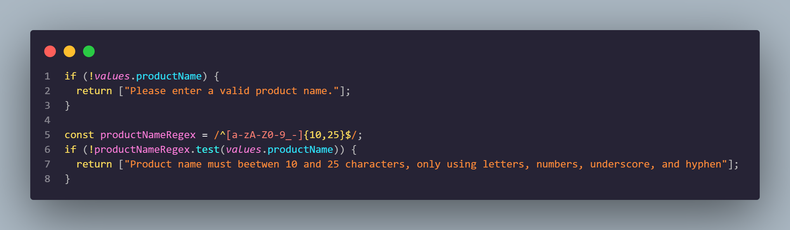

    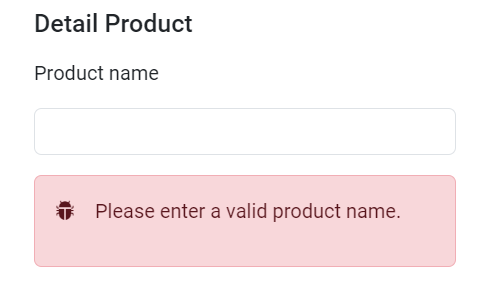

    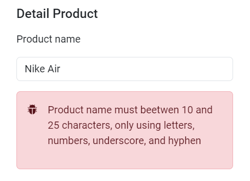

    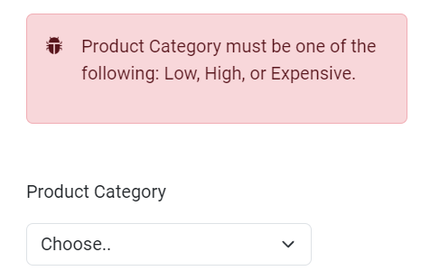

    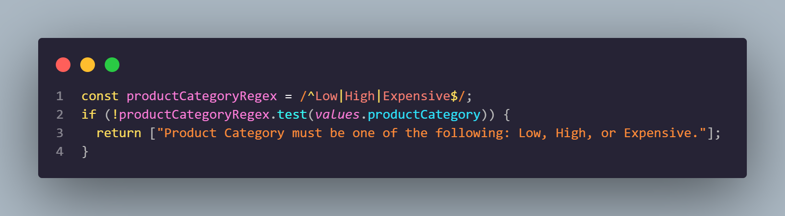

    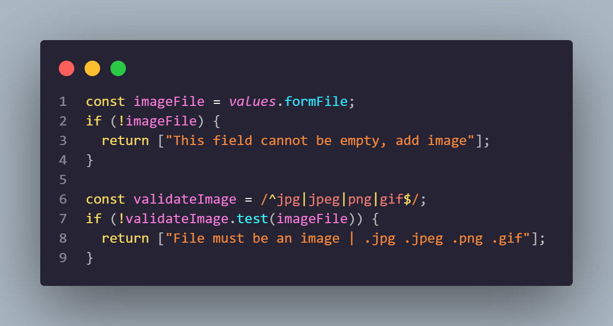

    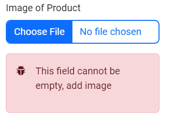

    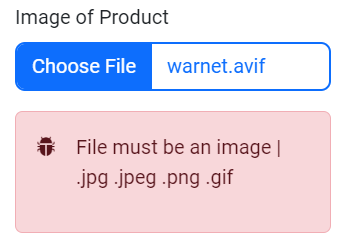

    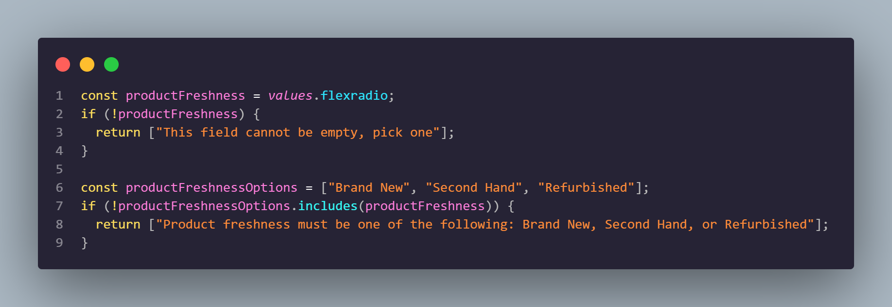

    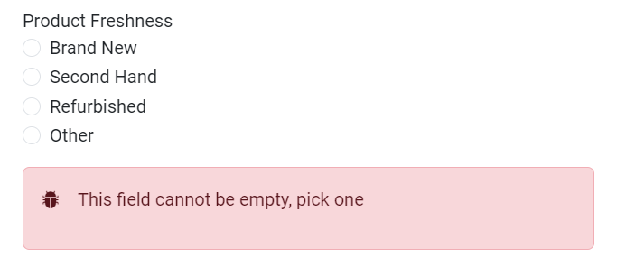

    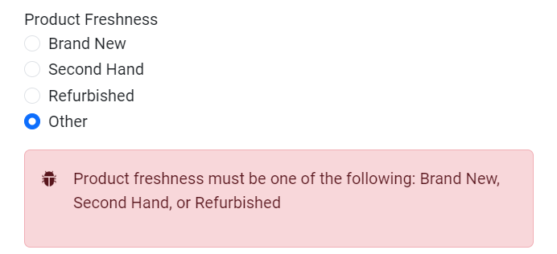

    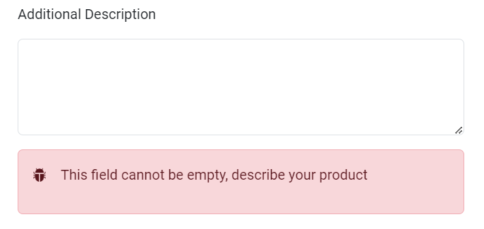

    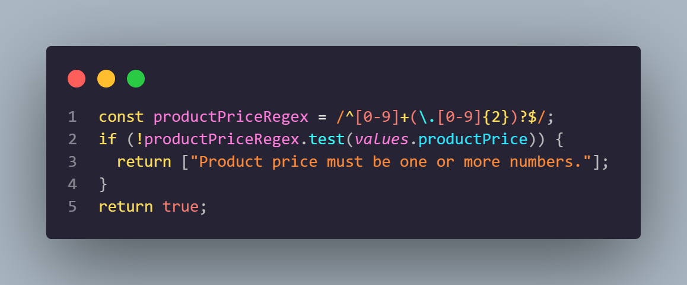

    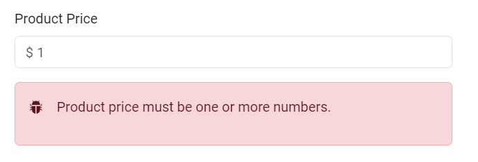

### Soal Prioritas 2 (Nilai 20)

- Buatlah form image dan Product Freshness dapat berfungsi dan ketika user menggunakan form tersebut. datanya akan masuk ke dalam tabel.

    

    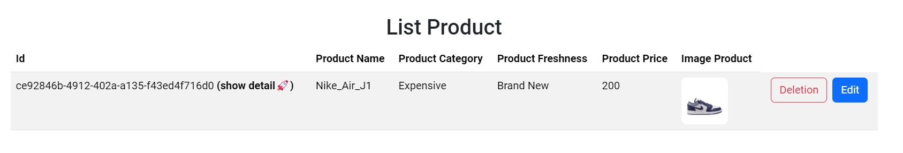

- Buatlah validasi untuk Image dan Product Freshness sehingga data yang di masukkan valid.

    

    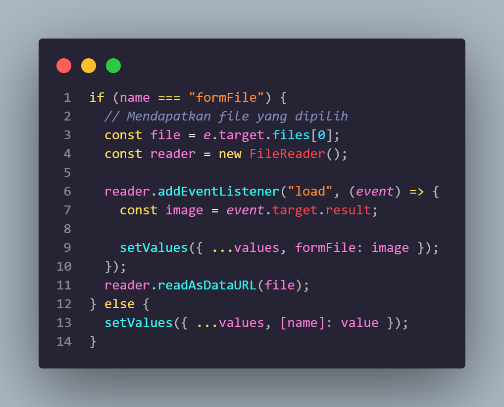

    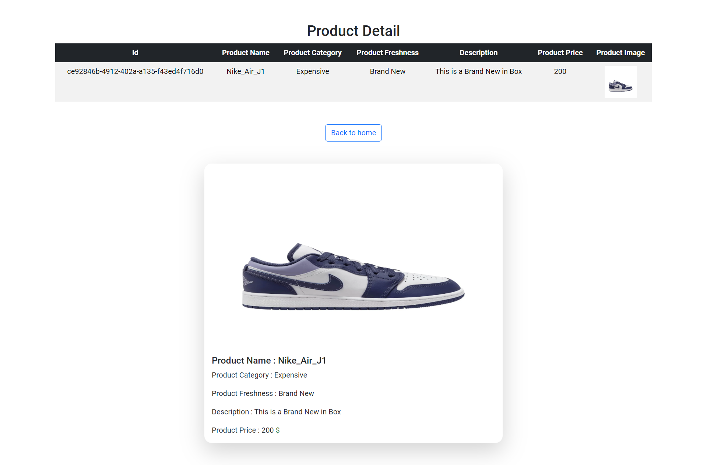

