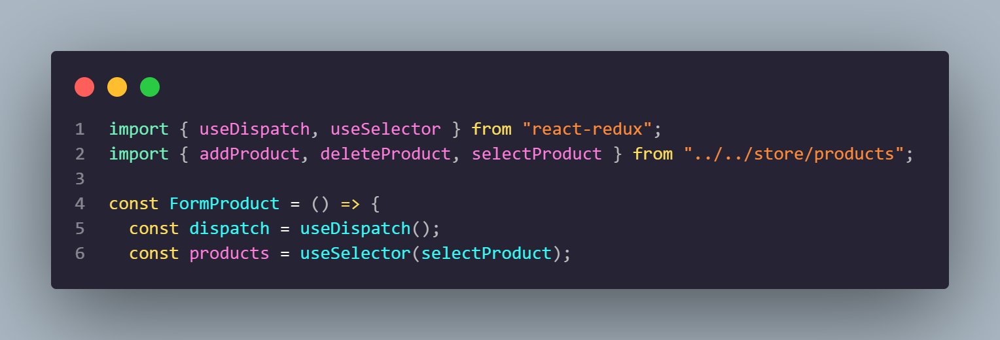
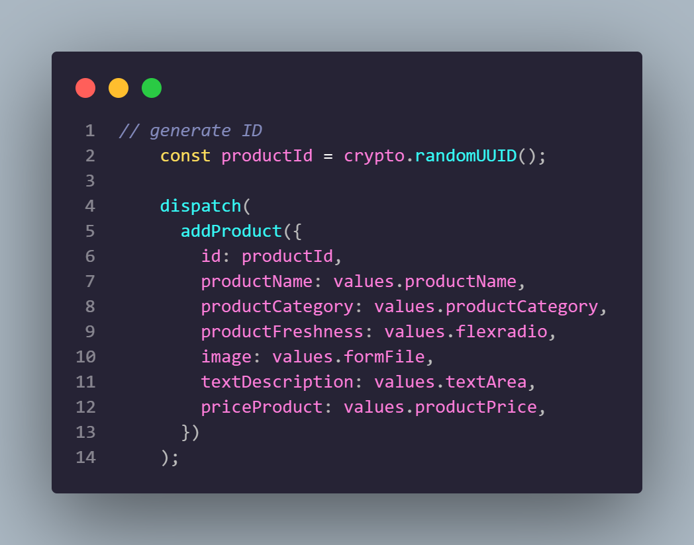
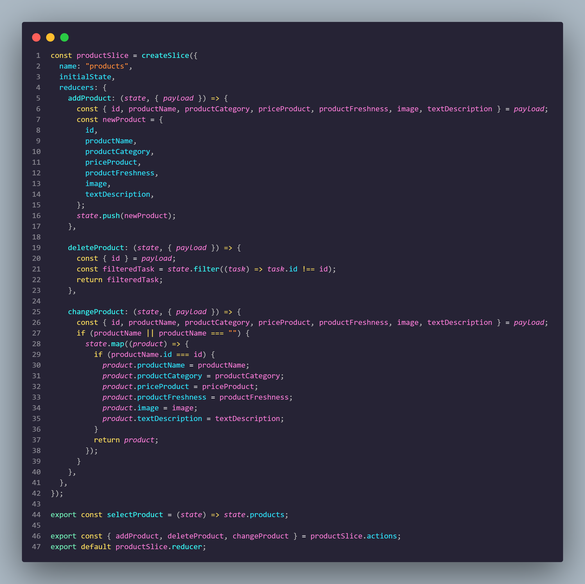
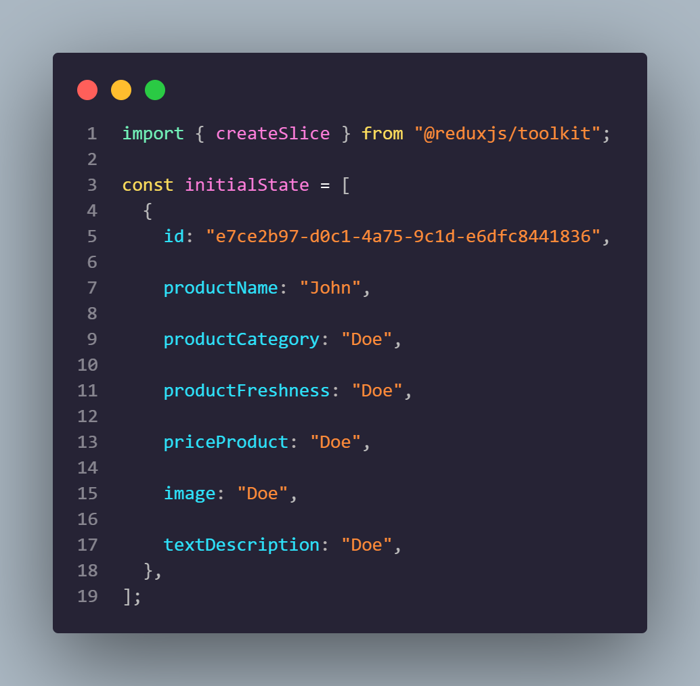
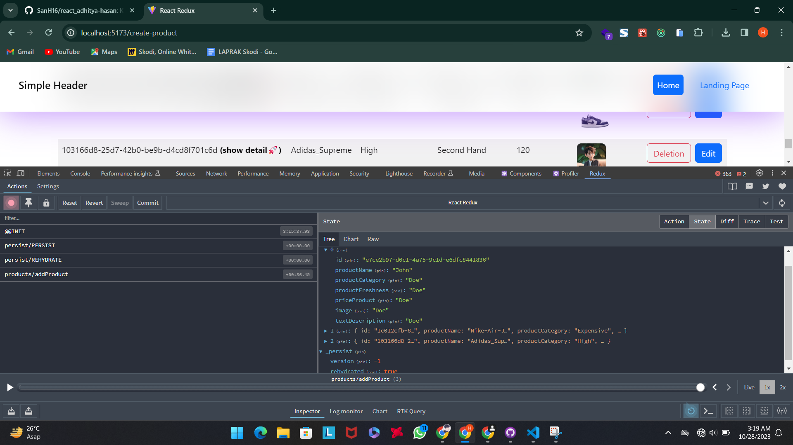
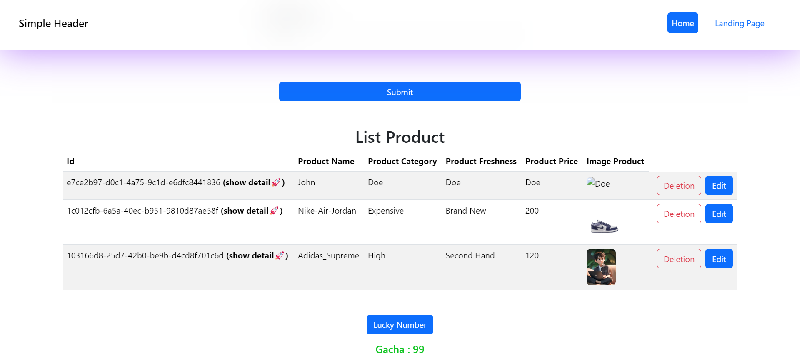
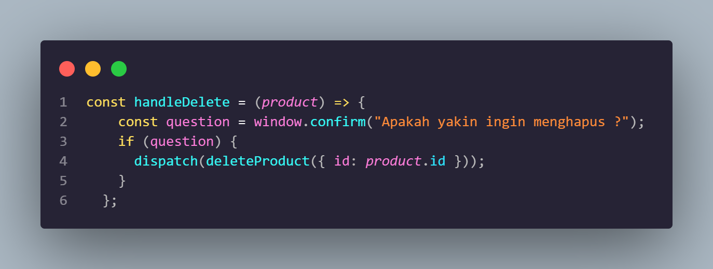
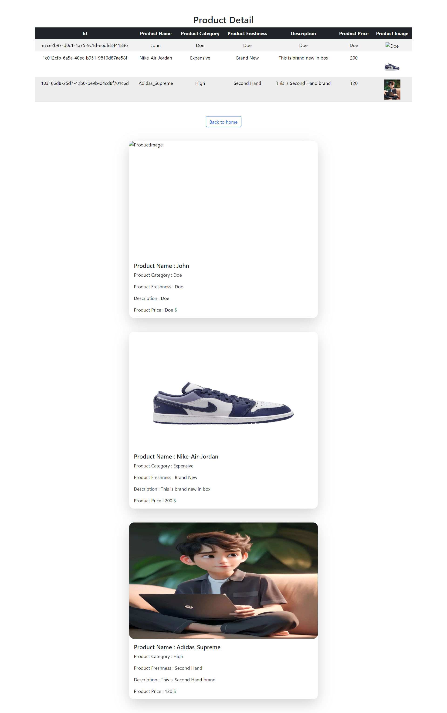

# Resume Materi KMReact - Global State Management and DataFetching

## 3 Poin penting

## Global State Management

Pola dan alat yang disediakan oleh Redux memudahkan untuk memahami kapan, di mana, mengapa, dan bagaimana status aplikasi diperbarui, dan bagaimana logika aplikasi akan berperilaku ketika perubahan tersebut terjadi.

## Redux

Redux menyediakan centralized store (penyimpanan state)
kenapa menggunakan redux ? karena butuh global state dan mudah untuk di maintain, mudah dikembangkan, dan mudah untuk dibaca.
kapan harus menggunakan Redux ?

- ketika punya banyak state di banyak tempat (component)
- ketika state sering diubah
- ketika logic untuk mengubah state itu kompleks

3 Core konsep redux

- state
- action
- view

## Redux Toolkit

Beberapa keunggulan redux toolkit

- simple : creating reducing, store setup, immutable update logic
- opinionated
- powerful : slice (1 function melakukan byk hal)
- efektif : fokus core logic

props dari Provider adalah Store
<Provider store={Store}></Provider>

- cara mengakses global state pakai useSelector() : const tasks = useSelector((state) => state.tasks);

- cara trigger actions menggunakan dispacth = useDispatch();

# 📝 Task

## Soal Prioritas 1 (Nilai 80)

- Rubahlah list products yang sebelumnya berupa state biasa menjadi global state menggunakan redux.

    

    

    

- Masukkan data user ke dalam Initial state seperti contoh di bawah
  const initialState = {

products: [

{

id: "e7ce2b97-d0c1-4a75-9c1d-e6dfc8441836",

productName: "John",

productCategory: "Doe",

productFreshness: "Doe",

productPrice: "Doe",

image: "Doe",

additionalDescription: "Doe",

}

]

};

    

- Pastikan data List Product (ilustrasi pada gambar) berasal dari initialState pada store.

    

    

## Soal Prioritas 2 (Nilai 20)

- Tambahkan fitur untuk menambah, mengedit, dan menghapus data user dalam komponen ListProduct.jsx dengan menggunakan action dan reducer yang sesuai. untuk form edit/menambah kalian dapat menggunakan komponent CreateProduct.jsx atau membuat komponen lain jika diperlukan.\

    

    

