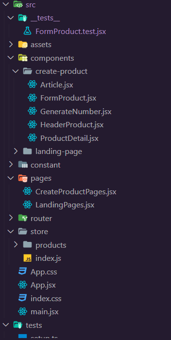
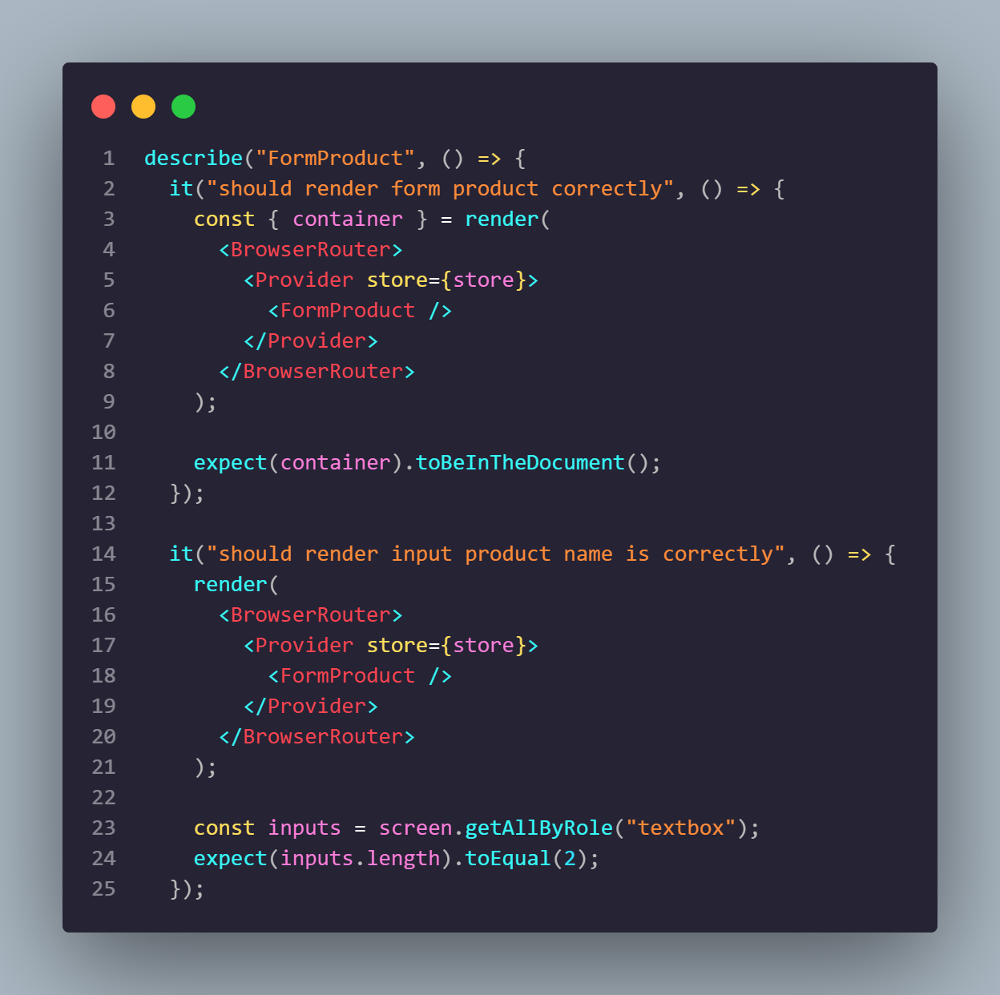
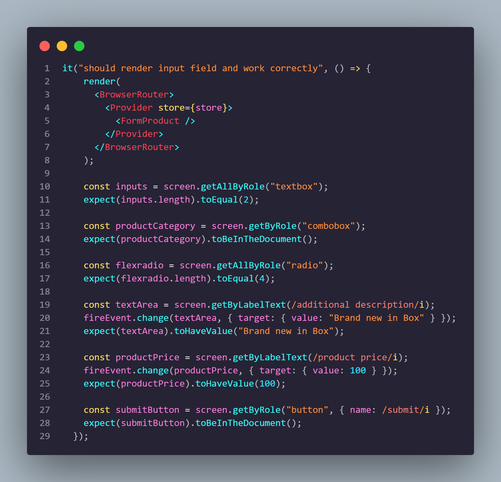
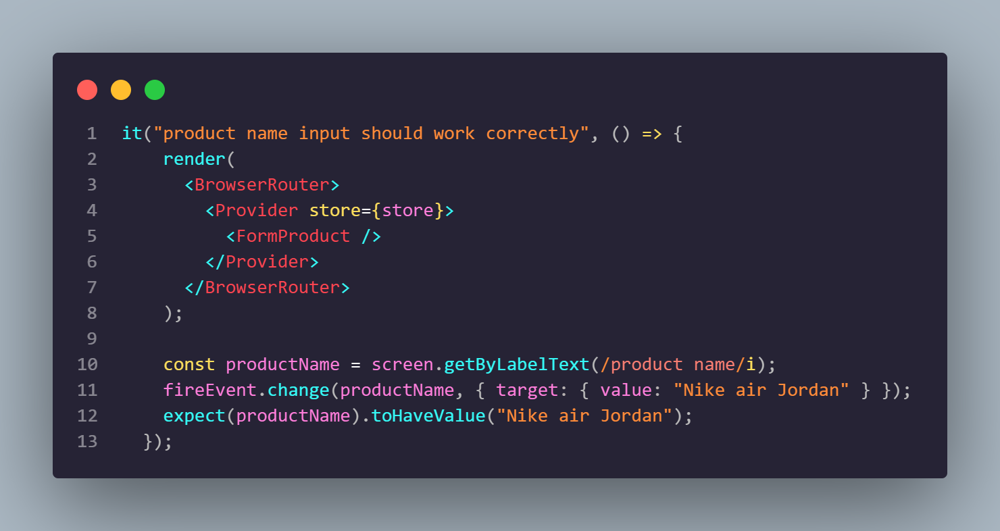
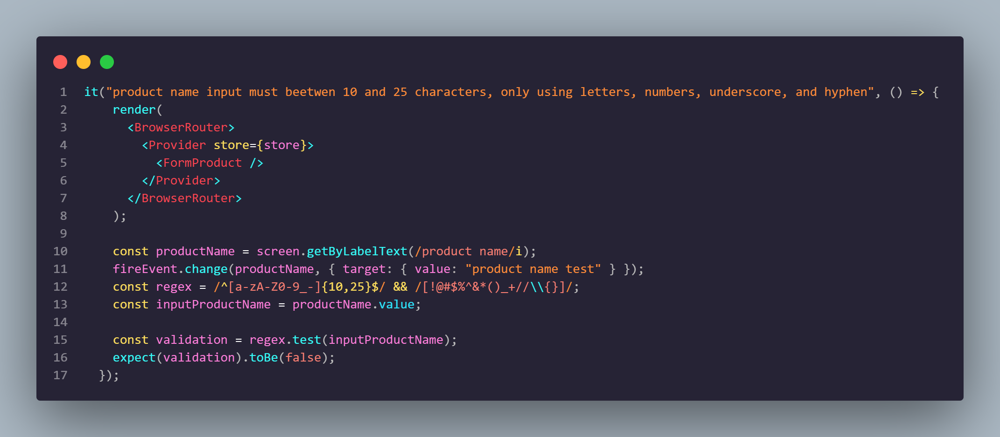
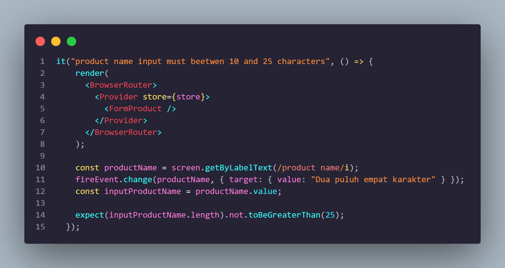
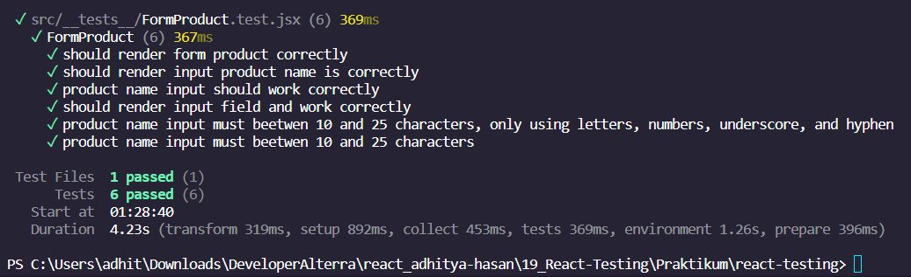

# Resume Materi KMReact - React Testing

## 3 Poin penting

### React Testing

React testing adalah proses pengujian aplikasi React untuk memastikan bahwa aplikasi tersebut berfungsi dengan benar. Testing adalah bagian penting dari pengembangan perangkat lunak karena dapat membantu menemukan dan memperbaiki bug, meningkatkan kualitas aplikasi, dan memastikan bahwa aplikasi berfungsi dengan baik di semua kondisi.

### Unit Testing

Unit testing adalah jenis testing yang paling dasar dalam React testing. Unit testing dilakukan untuk menguji fungsionalitas komponen React secara individu. Unit testing biasanya dilakukan dengan menggunakan library seperti Jest.

### Jenis react testing

Ada berbagai jenis react testing selain Unit Testing, antara lain:

- Integration testing: Integration testing adalah jenis testing yang dilakukan untuk menguji interaksi antar komponen React.
- End-to-end testing: End-to-end testing adalah jenis testing yang dilakukan untuk menguji keseluruhan aplikasi React.

## 📝 Task

### Soal Prioritas 1 (Nilai 80)

- Buatlah file baru bernama CreateProduct.test.js didirectory yang sama tempat CreateProduct.jsx disimpan

    

- Pada file CreateProduct.test.js buatlah test untuk memastikan bahwa form input Product Name dapat menerima input teks dan menampilkannya di halaman.

    

- Buatlah test untuk memastikan bahwa pilihan setiap form yang dipilih dapat disimpan dan ditampilkan dengan benar.

    

### Soal Prioritas 2 (Nilai 20)

- Buatlah test untuk memastikan validasi form input yang benar, seperti memastikan bahwa Product Name tidak boleh kosong, tidak mengandung karakter @/#{}.

    

    

- Buatlah test untuk memastikan validasi form input yang benar bahwaProduct Name tidak melebihin 25 karakter

    

-Buatlah test untuk memastikan validasi semua form field tersebut tidak boleh kosong.

    

    

