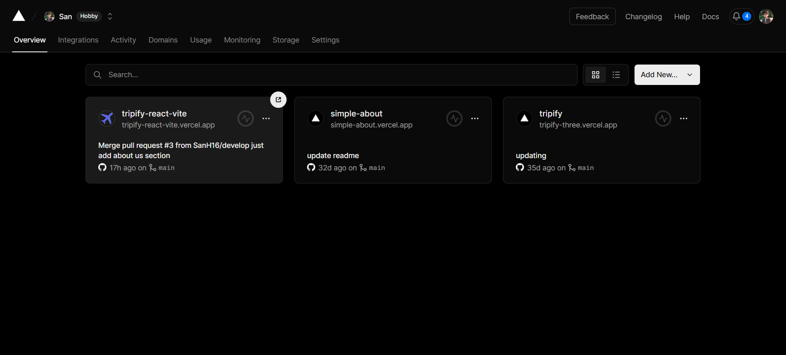
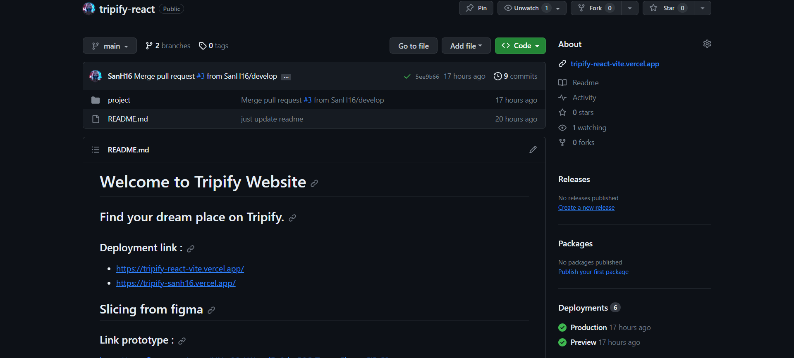
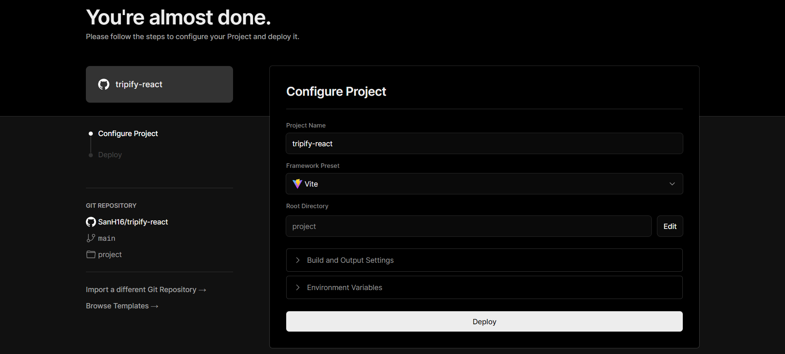
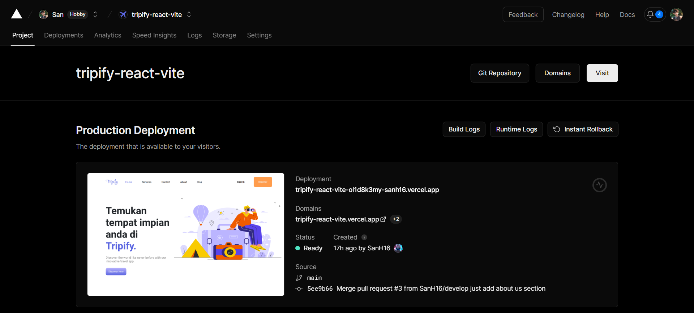
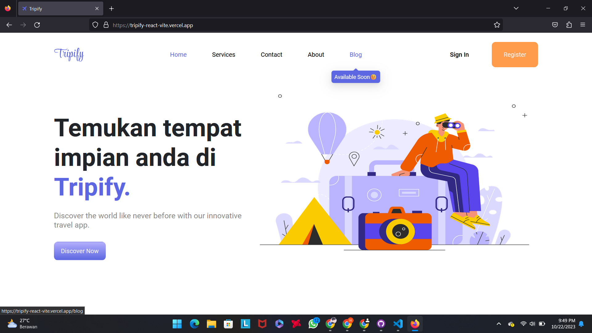
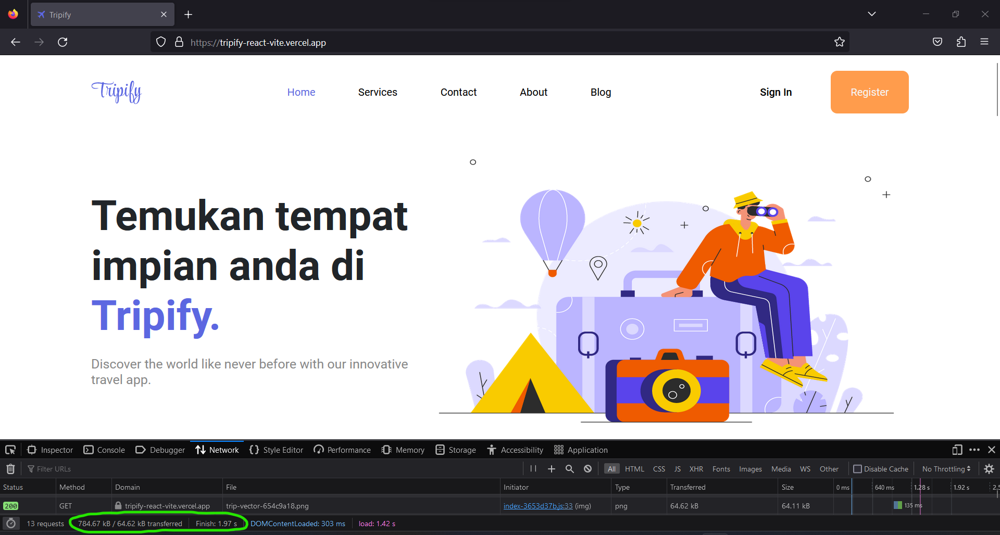

# Resume Materi KMReact - Deployment

## 3 Poin penting

## Deployment

Deployment adalah proses mengupload aplikasi dari fase development menjadi production (public). Adapun beberapa proses dalam melakukan deploy, seperti:

Build: Mengkompilasi source code aplikasi menjadi code yang dapat dijalankan dan ringkas.
Package: Membuat kode yang telah dikompilasi menjadi file yang dapat didistribusikan.
Deploy: Mengupload file yang telah dibungkus menjadi package ke server produksi.

Vercel adalah cloud yang menyediakan layanan deployment untuk aplikasi website maupun mobile. Vercel mempunyai banyak fitur untuk memudahkan proses deployment.

## Package Build

Seperti yang telah dijelaskan diatas, tujuan menjalankan build adalah membantu untuk meringankan aplikasi dan meningkatkan peformance dari aplikasi tersebut, build menghasilkan folder yang berisikan file-file yang telah dicompile dalam ukuran kecil kemudian package build inilah yang akan dideploy oleh platform deployment seperti vercel.

Cara menjalankan build pada aplikasi React :
npm run build

## Platform deployment

Berikut adalah beberapa platform yang menyediakan layanan untuk melakukan deployment website :

- Vercel
- Heroku
- Surge
- Netlify
- Github

# Task

## Deployment with Vercel

## Soal

- Buat akun di Vercel dan buat project baru.
- Integrasikan akun Vercel dengan akun GitHub Anda.

    

- Buat repository baru di GitHub untuk menyimpan project ReactJs kamu dika belum, dan push kode aplikasi ReactJS Anda ke repository tersebut jika belum.

    

- Pilih repository yang telah kalian push kode aplikasi ke dalamnya di Vercel, kemudian ikuti langkah-langkah untuk mendeploy aplikasi ReactJS ke Vercel.

    

    

- Pastikan aplikasi kalian dapat di akses dengan URL yang telah diberikan Vercel

    

    

# Welcome to Tripify Website

## Find your dream place on Tripify.

### Deployment link :

- https://tripify-react-vite.vercel.app/
- https://tripify-sanh16.vercel.app/

## Slicing from figma

### Link prototype :

https://www.figma.com/proto/NNrc96pW1vxniDs9dvcR0G/Tugas-Figma-SIB-5?page-id=0%3A1&type=design&node-id=1-2&viewport=373%2C-76%2C0.43&t=3Ze9LzwmZYNvFgP2-1&scaling=min-zoom&mode=design

This website was deployment in: 10/22/2023 ⏱

Credits: Adhitya Hasan

Last Edited on: 09/16/2023
