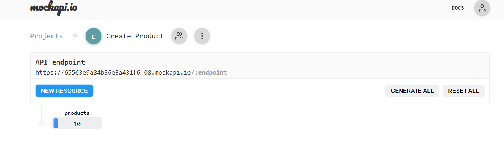
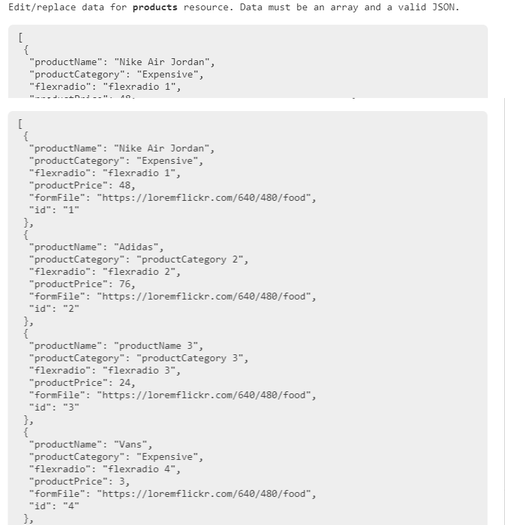
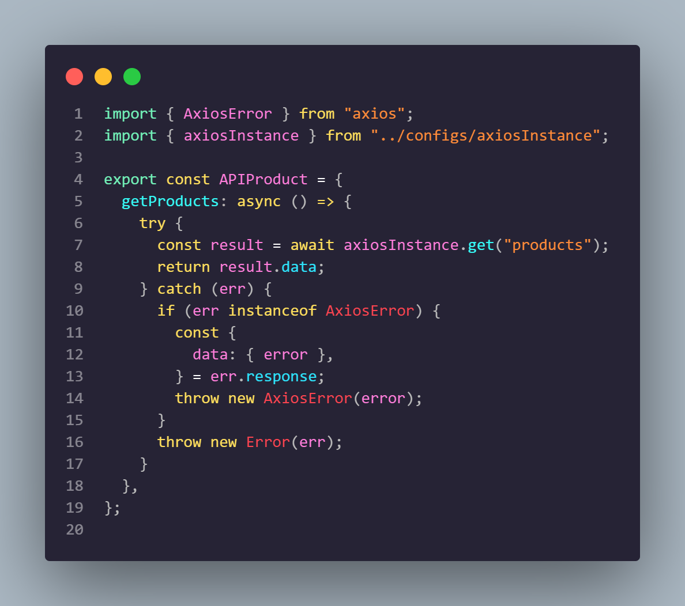
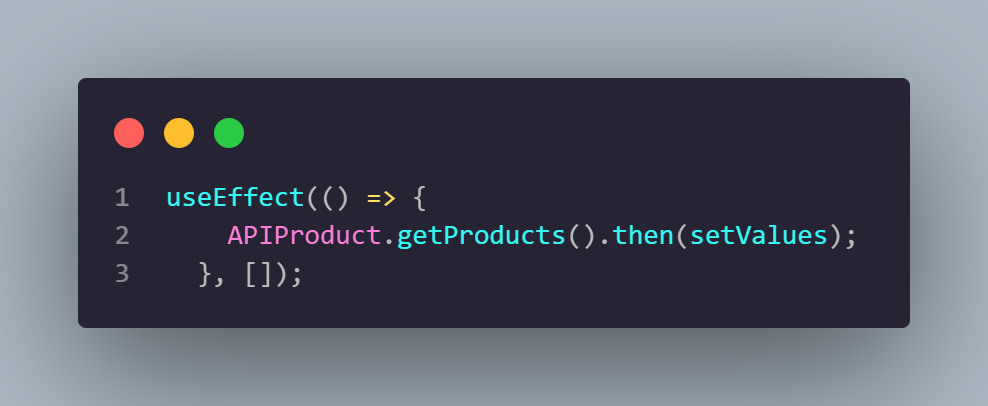
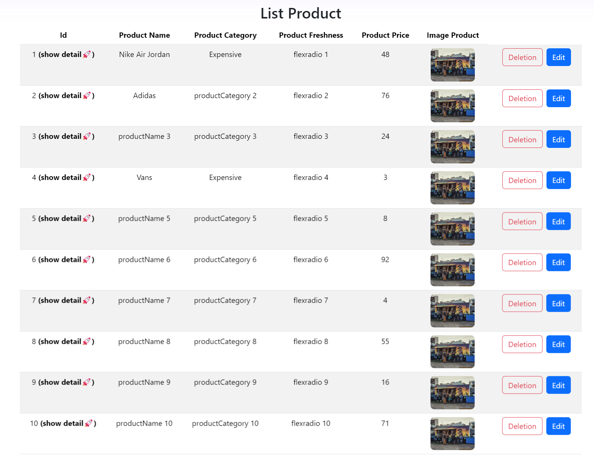

# Resume Materi KMReact - Introduction Restfull API

## 3 Poin penting

## Restfull API

RESTful API dirancang untuk berorientasi pada resource. Hal ini berarti bahwa setiap endpoint API mewakili sebuah resource tertentu. Misalnya, endpoint /users mewakili resource pengguna, dan endpoint /posts mewakili resource postingan.

Resource-oriented
RESTful API dirancang untuk berorientasi pada resource. Hal ini berarti bahwa setiap endpoint API mewakili sebuah resource tertentu. Misalnya, endpoint /users mewakili resource pengguna, dan endpoint /posts mewakili resource postingan.

Stateless
RESTful API stateless, artinya setiap request API berdiri sendiri dan tidak bergantung pada request sebelumnya. Hal ini membuat RESTful API lebih mudah untuk dikembangkan dan dipelihara.

# 📝 Task

## Soal Introduction Restfull API

- Buat akun di MockAPI (https://mockapi.io/)

    

- Buat endpoint baru di MockAPI dengan spesifikasi minimal sebagai berikut:.
Method: GET
URL: /products
Response: JSON array yang berisi daftar product
Skema product memiliki field yang sama seperti form input CreateProduct.jsx

  

    

- Tambahkan dependensi axios ke aplikasi ReactJS kalian

    

- Sambungkan data pada mockAPI ke List Product

    

- Gunakan axios untuk mengambil data dari endpoint MockAPI dan tampilkan daftar user tersebut di komponen/halaman ListProduct.jsx yang sudah anda buat.

    

    

