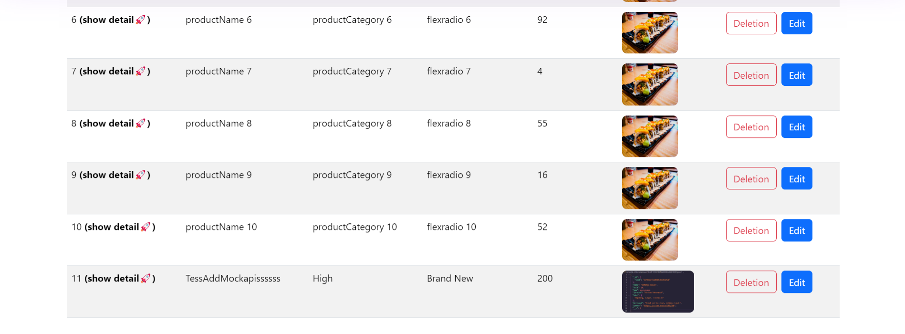
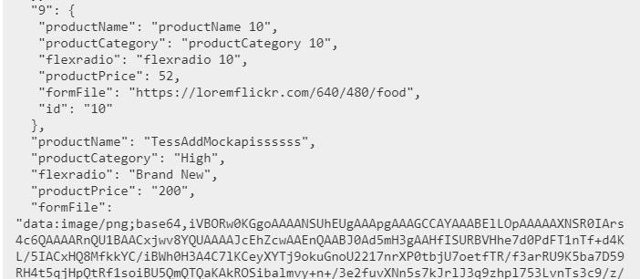
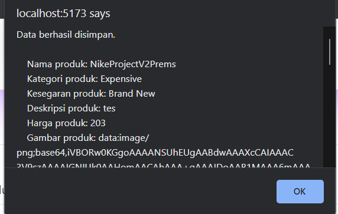
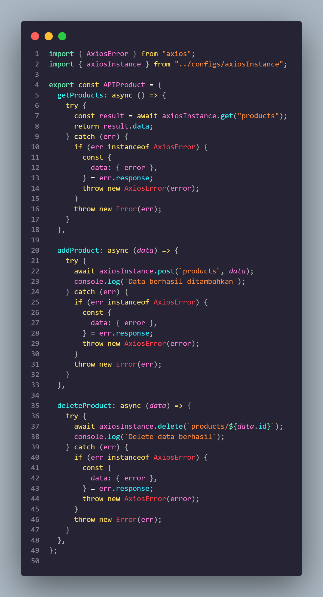
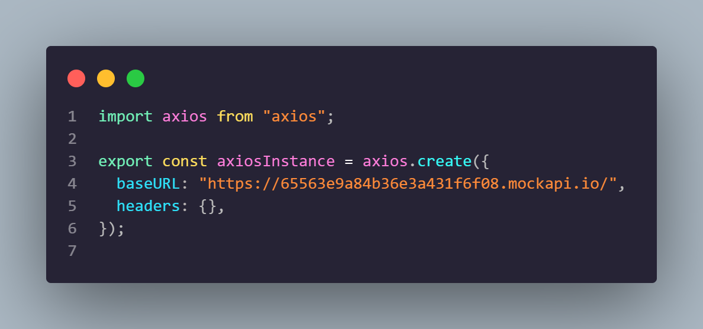
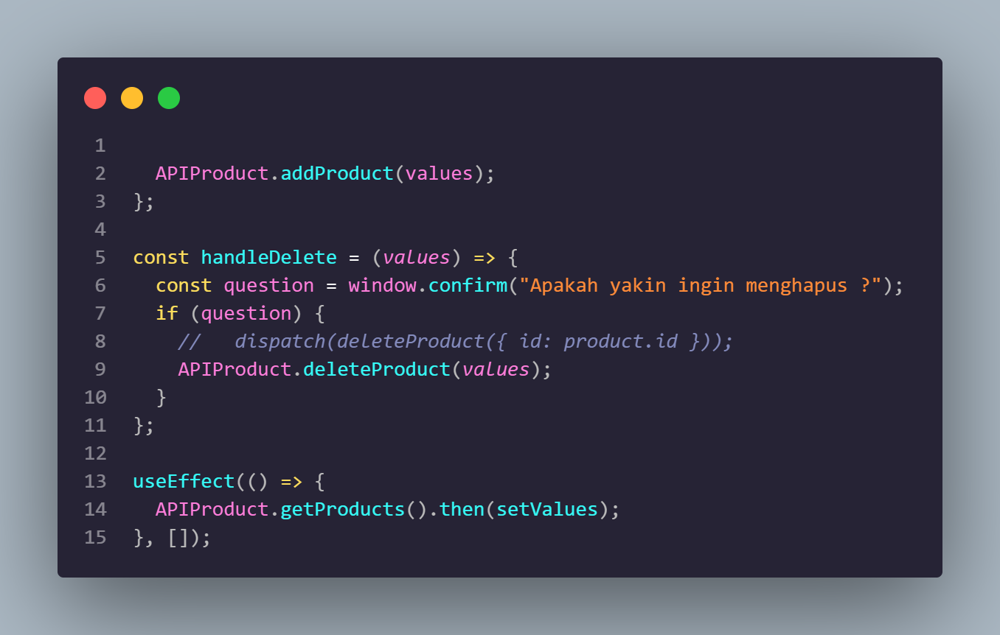

# Resume Materi KMReact - Introduction React

## 3 Poin penting

### Restfull API

RESTful API menggunakan protokol HTTP untuk melakukan pertukaran data. API merupakan jembatan untuk menghubungkan pertukaran data antara backend dan frontend, RESTful API terdiri dari empat komponen utama, antara lain:

Endpoint: Endpoint adalah alamat URL yang digunakan untuk mengakses API.
Metode HTTP: Metode HTTP menentukan tindakan yang dilakukan oleh client terhadap server.
Header: Header adalah informasi tambahan yang dikirimkan bersama permintaan atau respons.
Body: Body adalah data yang dikirimkan bersama permintaan atau respons.

### HTTP Method

Metode HTTP adalah bagian penting dari REST API. Metode HTTP menentukan tindakan yang dilakukan oleh client terhadap server. Ada beberapa metode HTTP yang umum digunakan dalam REST API, yaitu:

- GET digunakan untuk mengambil data dari server.
  Metode GET digunakan untuk mengambil data dari server. Data yang diambil dapat berupa data tunggal, kumpulan data, atau halaman web

- POST digunakan untuk membuat data baru di server.
  Metode POST digunakan untuk membuat data baru di server. Data yang dibuat dapat berupa data tunggal, kumpulan data, atau halaman web.

- PUT digunakan untuk memperbarui data di server.
  Metode PUT digunakan untuk memperbarui data di server. Data yang diperbarui dapat berupa data tunggal, kumpulan data, atau halaman web.

- DELETE digunakan untuk menghapus data di server.
  Metode DELETE digunakan untuk menghapus data di server. Data yang dihapus dapat berupa data tunggal, kumpulan data, atau halaman web.

### Keunggulan RESTfull API

RESTful API memiliki beberapa keunggulan, antara lain:

Fleksibel: RESTful API dapat digunakan untuk berbagai jenis aplikasi.
Scalable: RESTful API dapat diskala dengan mudah untuk memenuhi kebutuhan yang meningkat.
Secure: RESTful API dapat dilindungi dengan menggunakan berbagai metode keamanan.

# 📝 Task

## Soal Restfull API

- Pada data dari form input komponen CreateProduct.jsx yang sebelumnya disimpan kedalam state dan LocalStorage. Sekarang simpan data tersebuh ke Rest API yang sudah kalian buat dengan MockAPI menggunakan librrary axios dan dengan http method POST dan tampilkan pesan sukses jika berhasil menyimpan data.
  Buatlah fitur update data user dihalaman ListProduct.jsx dan update data product dari RestAPI yang sudah kalian buat dengan MockAPI. Update data product dengan mengirim request ke Rest API tersebut menggunakan library axios dengan http method PUT dan tampilkan pesan sukses diupdate jika berhasil mengupdate data.
  Buatlah fitur delete data product dihalaman ListProduct.jsx. Lakukan request ke server Rest API dengan axios ke endpoint untuk delete data dengan http method DELETE dan berikan pesan sukses delete jika berhasil menghapus data dari server Rest API.

    

    

    

    

    

    

