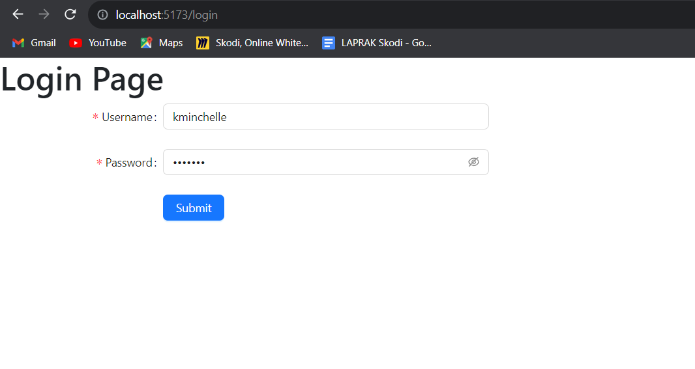
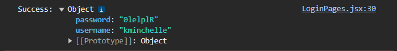
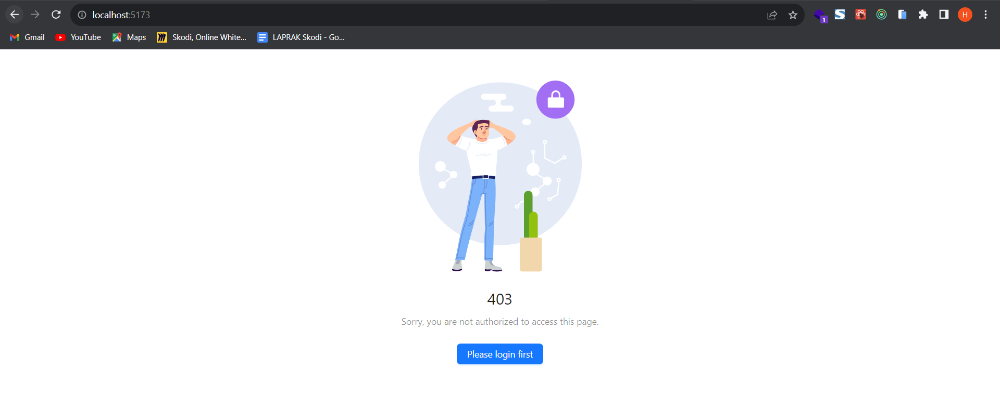
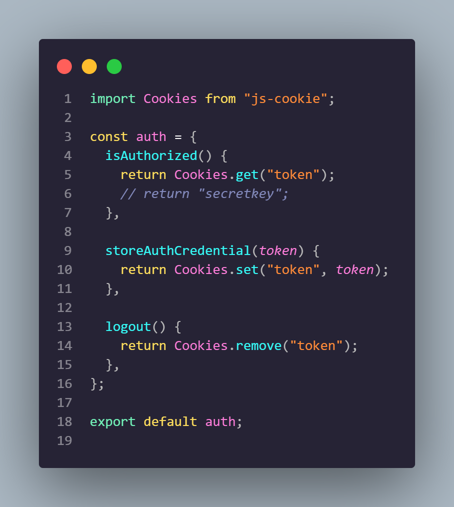
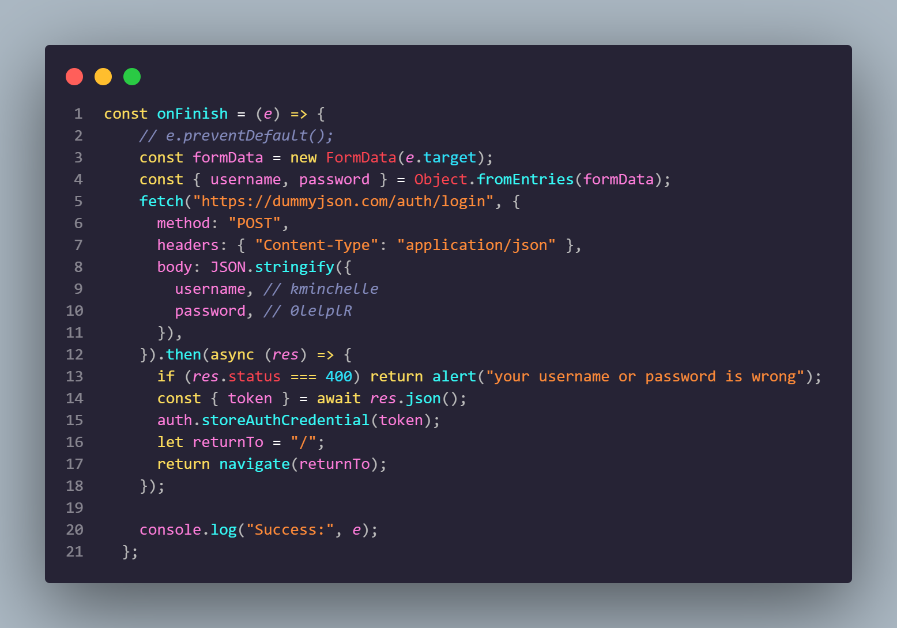

# Resume Materi KMReact - Authentication React

## 3 Poin penting

## Authentication

# 📝 Task

## Soal Authentication in React

Buatlah Authentication dan Authorization dari project yang telah kalian buat sebelumnya. manfaatkan data dummy pada local storage untuk proses tersebut. contoh kode sebagai berikut
Kalian boleh mengganti kode di bawah sesuai dengan project kalian, kode di bawah hanya di gunakan sebagia acuan.

    

    

    

    

    

