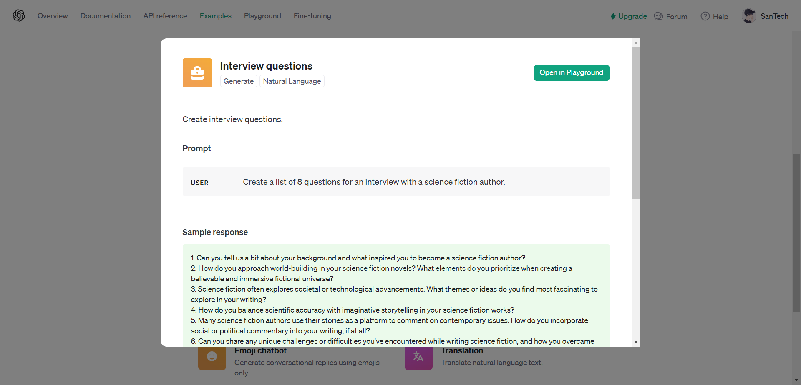
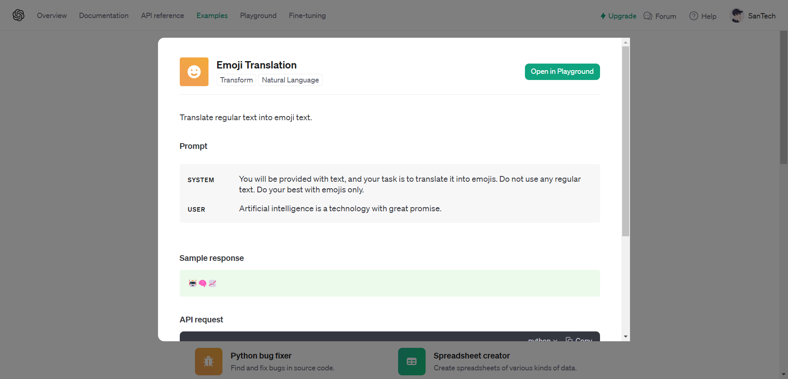
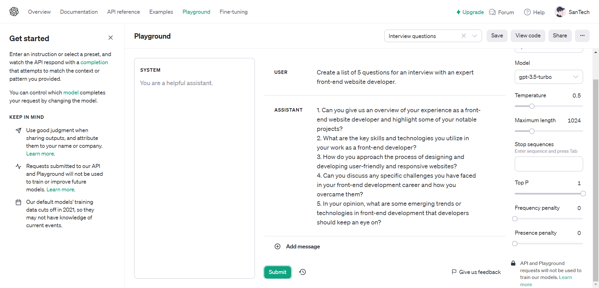
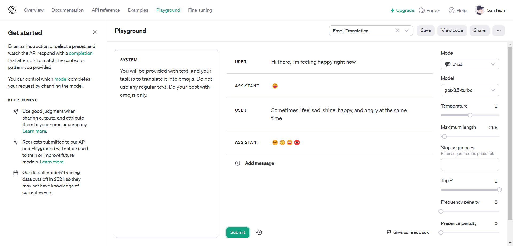

# Resume Materi KMReact - Perkenalan AI & OpenAI React

## 3 Poin penting

## Definitions AI

AI atau kecerdasan buatan adalah teknologi yang membuat mesin dapat berpikir dan bertindak seperti manusia. AI dapat digunakan untuk berbagai macam tugas, seperti mengenali wajah, menerjemahkan bahasa, dan mengendarai mobil.

Penjelasan yang lebih sederhana, AI adalah kemampuan mesin untuk memahami, belajar, dan mengambil keputusan. AI dirancang untuk meniru kemampuan intelektual manusia, seperti kemampuan berpikir, belajar, dan memecahkan masalah.

## Application of AI in the real world

1. Marketing :

- Sales forecasting : membantu perkiraan penjualan
- Content Personalization : membantu management konten
- Dynamic Pricing : membantu menentukan harga product

2. Healthcare :

- Personalized Medicine : membantu personalisasi pengobatan
- Medical image analysis : membantu menganilisi pengobatan melalui gambar, grafik dan visual
- Patient monitoring : membantu memonitoring pasien

3. Aplikasi berbasis AI

- Face Recognition : membantu pengenalan wajah untuk berbagai kondisi
- Speech Recognition : membantu mengenali suara / asistant voice
- Autonomous vehicle : membantu kendaraan auto pilot atau berjalan dengan bantuan sistem
- Sentiment analysis : membantu menganilisi sentiment

## 4 Ethics for use and development of AI

- Fairness
- Transparency
- Privacy
- Human centeredness

# Instruksi Task :

## Praktikkan penggunakan OpenAI Playground

- Bisa menggunakan salah satu template yang ada di platform.openai.com/examples

1. examples template Interview Questions:

    

2. examples template Emoji Translation:

    

- Screenshot hasilnya (pastikan semua yang ada di layar masuk ke dalam screenshot)

### Interview Questions Result

    

### Emoji Translation Result

    

- Copy-paste input & output (text yang ada di dalam textbox)

### Interview Question

User : Create a list of 5 questions for an interview with an expert front-end website developer.
Assistant :

1. Can you give us an overview of your experience as a front-end website developer and highlight some of your notable projects?
2. What are the key skills and technologies you utilize in your work as a front-end developer?
3. How do you approach the process of designing and developing user-friendly and responsive websites?
4. Can you discuss any specific challenges you have faced in your front-end development career and how you overcame them?
5. In your opinion, what are some emerging trends or technologies in front-end development that developers should keep an eye on?

### Emoji Translation

User : Hi there, I'm feeling happy right now
Assistant : 😄
User : Sometimes I feel sad, shine, happy, and angry at the same time
Assistant : 😔🌞😄😡

- Kumpulkan hasil screenshot dan file txt seperti biasa

    <a href="https://docs.google.com/document/d/1GriHIFqT8FTEPyrF_3Umm98ohO6zrrOZQw9UEkZYwPU/edit?usp=sharing" target="_blank" >
    Link Google Docs
    </a>

