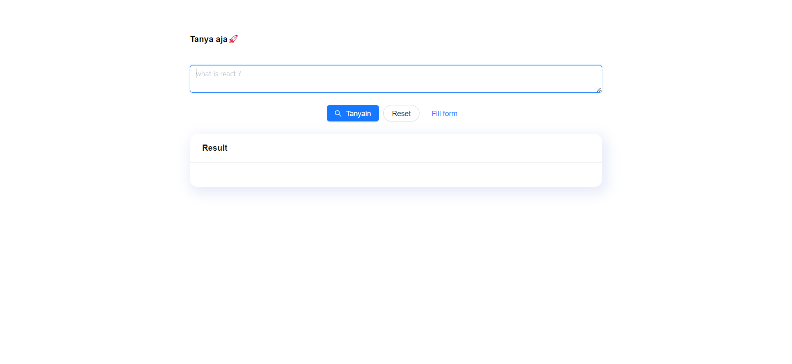
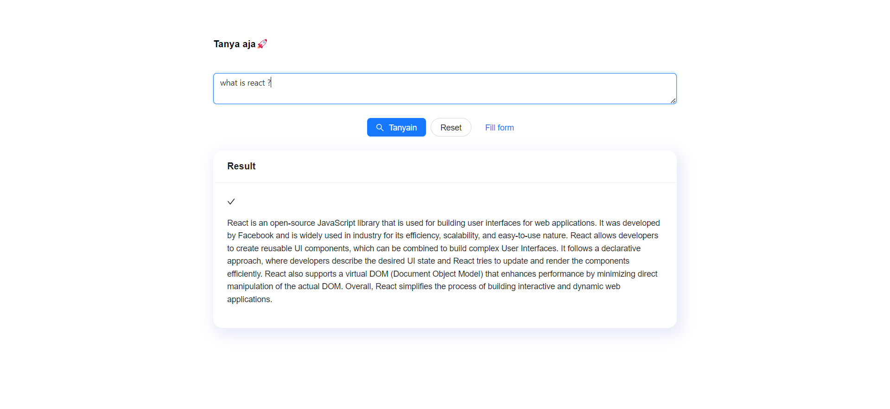
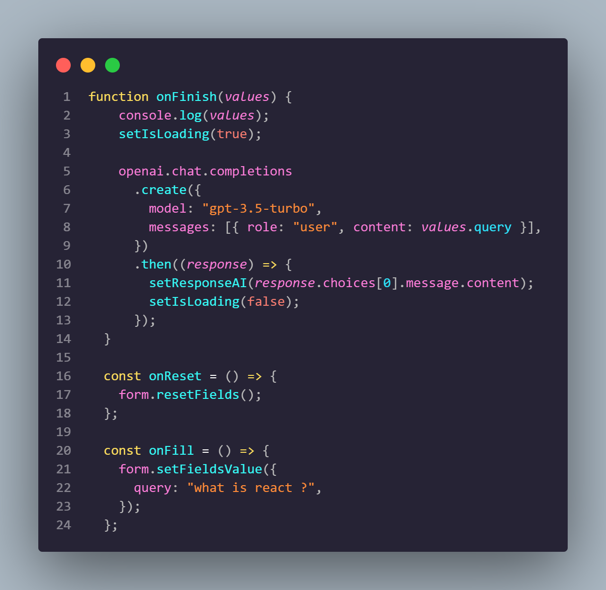
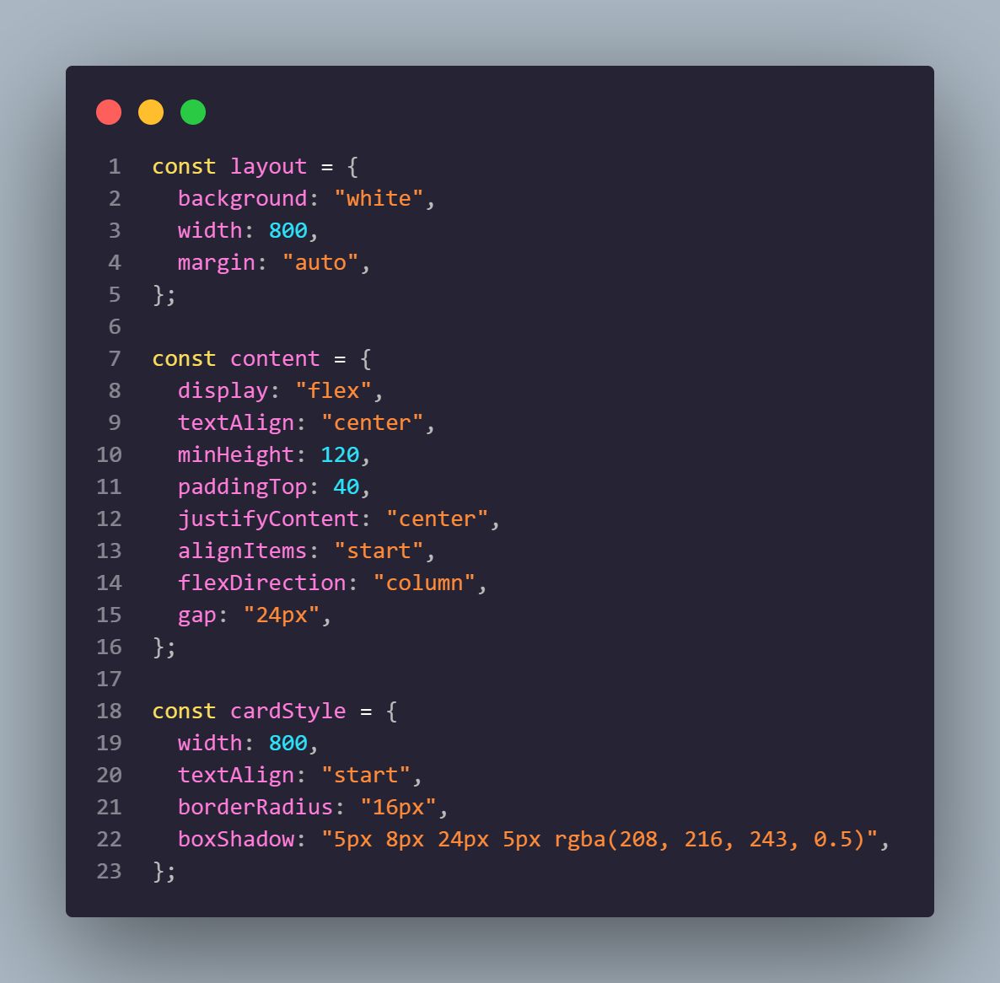
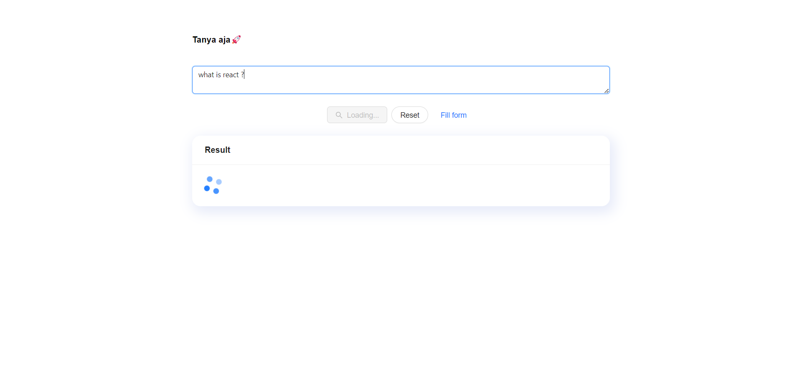

# Resume Materi KMReact - Installation OpenAI React

## 3 Poin penting

## Mengapa menggunakan OpenAI ?

OpenAI telah mengembangkan beberapa model AI yang paling canggih di dunia, termasuk GPT-3, InstructGPT, DALL-E 2, dan Codex. Model-model ini telah digunakan untuk mengembangkan berbagai aplikasi, termasuk penulisan kode otomatis, pembuatan konten, dan desain grafis.

OpenAI juga bekerja pada berbagai proyek penelitian, termasuk pengembangan AGI yang aman dan bermanfaat, serta pengembangan kebijakan dan peraturan untuk AI.

Adapun alasan lain mengapa kita menggunakan AI :

- Gratis (trial)
- Mudah dipasang
- Dipakai banyak user
- Jumlah parameter mencapai 175 miliar (model davinci 03)

## Penggunaan OpenAI pada React

- Membuat project React terlebih dahulu : npm create vite@latest nama-project -- --template react
- Melakukan pemasangan OpenAI : npm install openai
- Import module openai, setup apiKey yang didapat dari openai.playground
- Setup object and model openai yang ingin digunakan : openai.chat.completions.create({model, message, prompt/temperature/token dll..})
- Setup apiKey didalam .env : VITE_OPENAI_API_KEY=apiKey
- Rendering components

## Contoh penerapan OpenAI yang dapat digunakan dalam React:

- Chatbot : OpenAI GPT-3 dapat digunakan untuk mengembangkan chatbot yang dapat menjawab pertanyaan pengguna dan melakukan tugas-tugas sederhana, seperti memesan tiket atau membuat janji temu.
- Asisten virtual : OpenAI InstructGPT dapat digunakan untuk mengembangkan asisten virtual yang dapat membantu pengguna dengan berbagai tugas, seperti menulis email, membuat presentasi, dan menjadwalkan rapat.
- interview Question : OpenAI GPT-3.5 juga dapat digunakan untuk membuat pertanyaan-pertanyaan Interview question.

# 📝 Task

## Soal Prioritas 1 (70)

- Buatlah sebuah halaman baru yang terdapat form input dan button submit

    

    

- Hubungkan halaman tersebut dengan Open.ai sehingga ketika kita melakukan input akan dijawab oleh open.ai mode davinci 03

    

## Soal Prioritas 2 (30)

- Masukkan css atau interaksi lain yang menarik pada halaman sehingga mudah untuk digunakan. Kalian boleh menambahkan fitur lain diluar dari soal dengan tujuan memudahkan user

    

    

