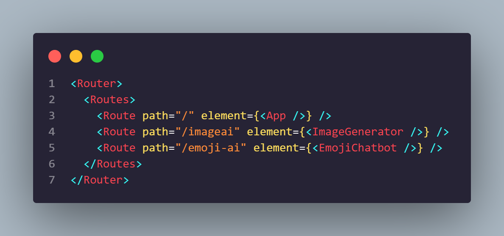
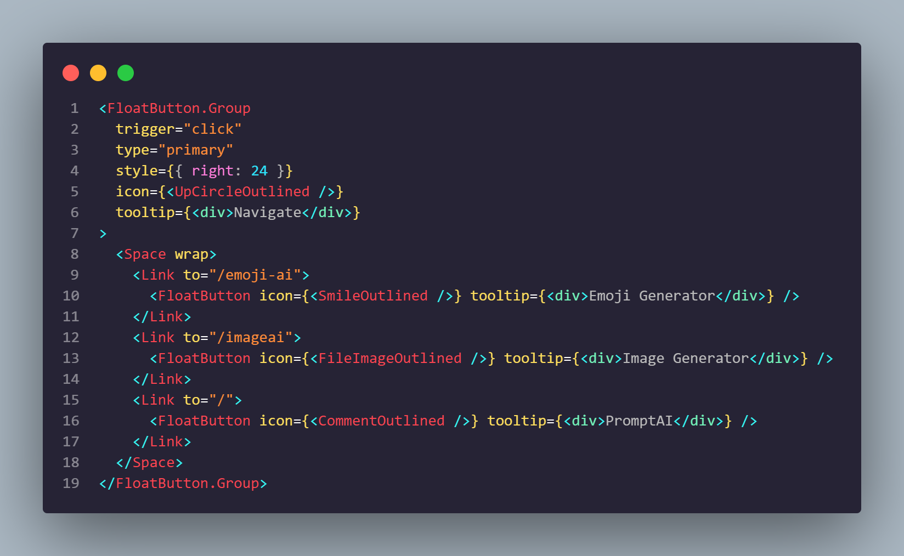
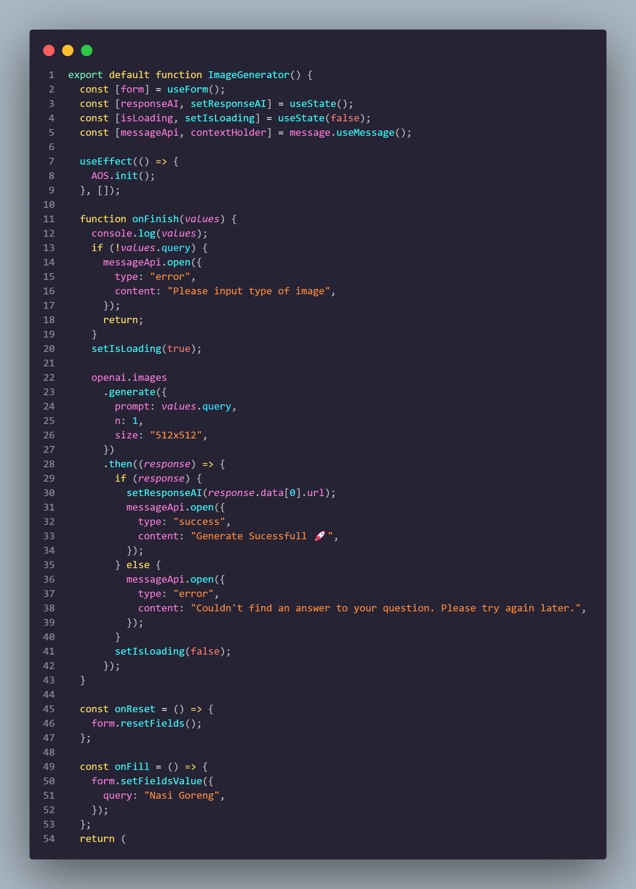
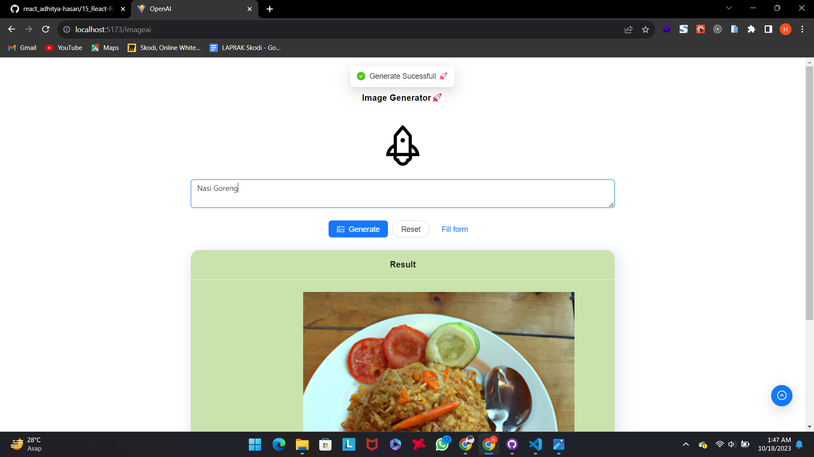
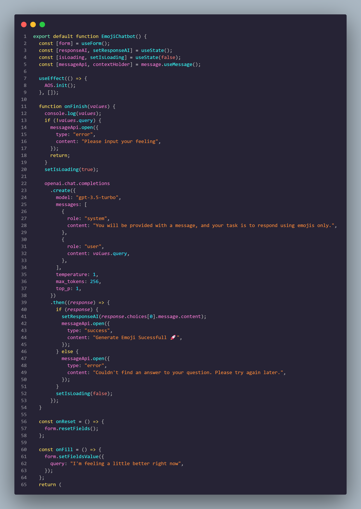
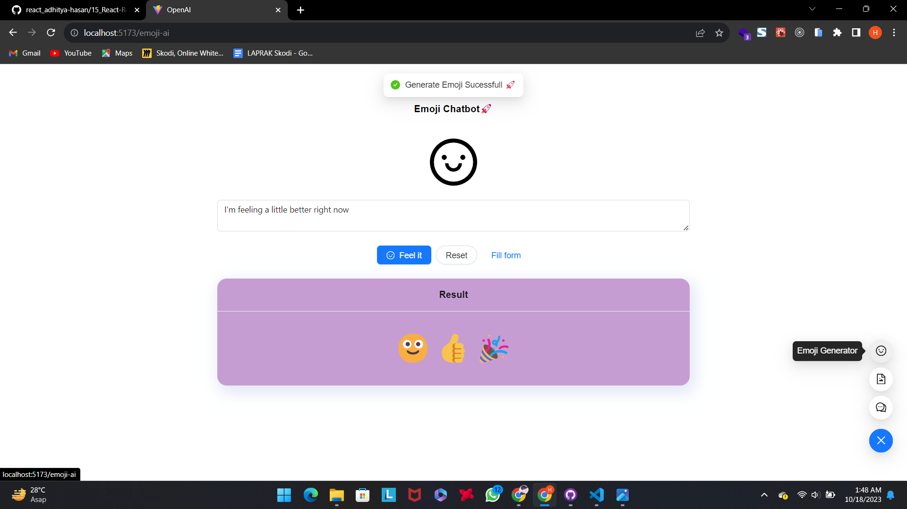

# Resume Materi KMReact - Basic Model OpenAI Prompt Engineer

## 3 Poin penting

## Keuntungan Belajar AI

- Meningkatkan Penggunaan Model OpenAI
- Menjadi bagian dari komunitas AI
- Mengoptimalkan Output Model AI
- Membangung Aplikasi AI yang lebih relevan
- Meningkatkan Daya Saing di Bidang AI

## Jenis atau Model OpenAI

- GPT-4: Model-model yang lebih baik dari GPT-3.5 dalam menghasilkan bahasa alami.
- GPT-3.5: Model-model yang lebih baik dari GPT-3 dalam menghasilkan bahasa alami.
- DALL-E: Model yang dapat menghasilkan dan mengedit gambar dari perintah bahasa alami.
- Whisper: Mengubah audio menjadi teks.
- Embeddings: Model-model yang dapat mengubah teks menjadi bentuk numerik.
- Moderasi: Dapat mendeteksi apakah teks mungkin sensitif atau tidak aman.

## Prompt Engineer

Prompt Engineer merupakan teknik yang digunakan untuk mengoptimalkan hasil maupun output yang di-generate dari model AI dengan cara memberikan instruksi yang spesifik agar output menghasilkan sesuai dengan context.

# 📝 Task

## Soal Prioritas 1 (70)

- Pakai tugas yang telah menerapkan OpenAI API dan terapkan prompt sehingga dapat berfungsi khusus untuk melakukan Q&A (tema Q&A bebas)

    

## Soal Prioritas 2 (30)

- Buat halaman baru yang terhubung ke OpenAI API

    

    

- Cari ide menarik yang memanfaatkan API OpenAI. Implementasikan ide tersebut menggunakan API OpenAI.

    

    

    

    

